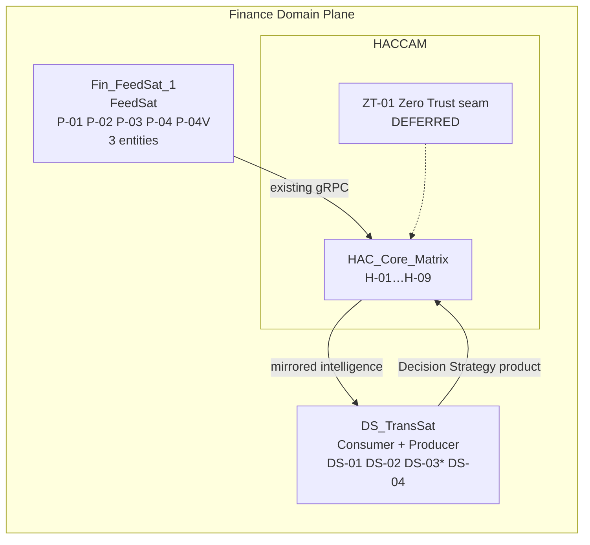
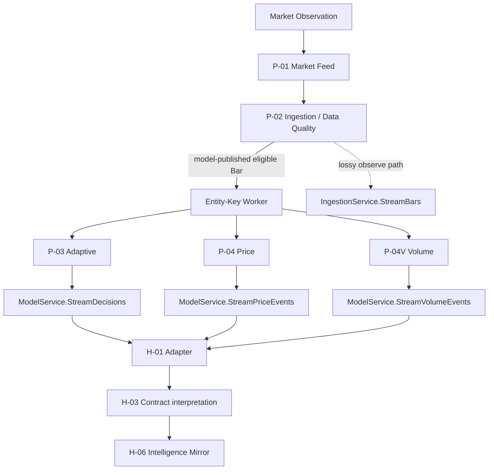
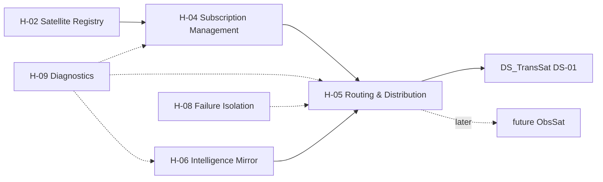
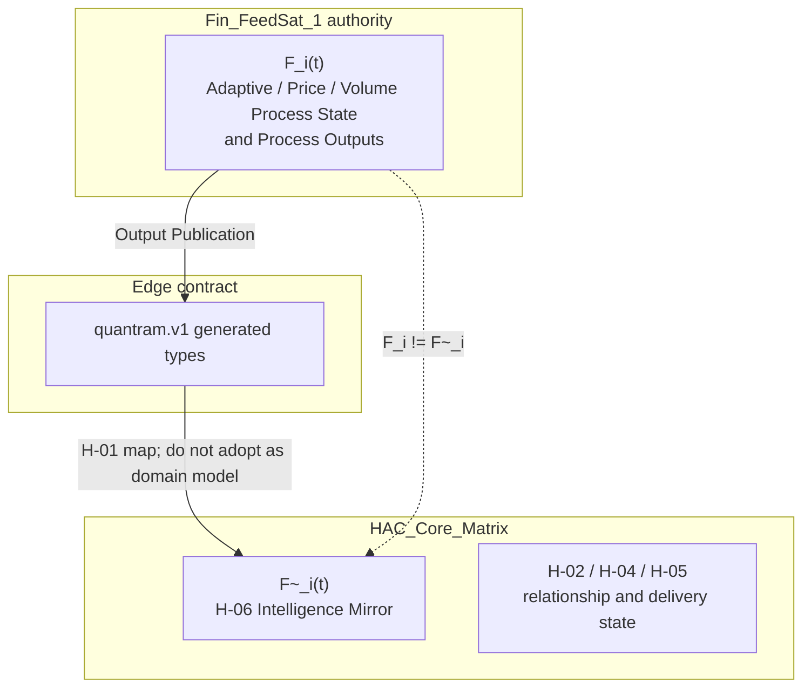
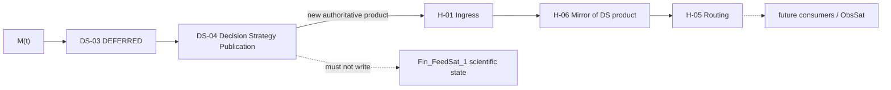
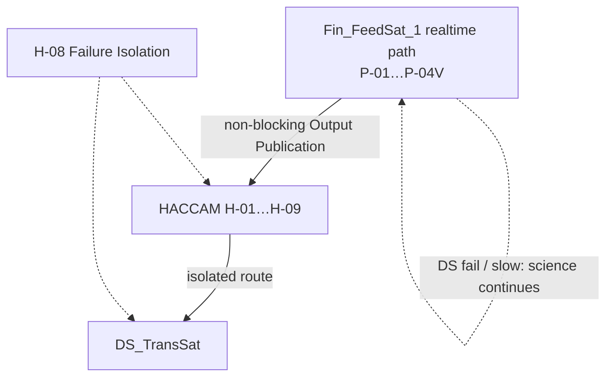

# HACCAM Process Model

**Title:** HACCAM Process Model V0.1  
**Document filename:** `HACCAM_PROCESS_MODEL_V0_1_090726.md`

## Date

2026-09-07

## Status

**PROPOSED FOR HUMAN REVIEW**

**Implementation:** NOT YET AUTHORIZED

This document is a design authority for the first HACCAM prototype process architecture. It does not authorize implementation, proto changes, QuanTRAM modification, Fin_FeedSat_1 creation, DS_TransSat code, Zero Trust, or neural-network work.

## Purpose

Define the first implementable HACCAM Process Model for Prototype V1: one Finance Domain FeedSat (`Fin_FeedSat_1`), one HACCAM core (`HAC_Core_Matrix` plus common satellite services), and one Decision Strategy TransSat (`DS_TransSat`).

The model exists so later implementation can proceed from named responsibilities, ownership, contracts, and failure behavior rather than from conceptual imagery or speculative final-system architecture.

## Scope

In scope:

- Prototype V1 process architecture for `Fin_FeedSat_1` + `HACCAM` / `HAC_Core_Matrix` + `DS_TransSat`
- factual relationship to the current QuanTRAM implementation, which is the authority for what `Fin_FeedSat_1` will initially contain
- existing QuanTRAM gRPC inventory and what HACCAM can actually consume today
- proposed HACCAM process inventory (new IDs, no collision with QuanTRAM `P-01`…`P-10`, `P-04V`, `C-01`)
- intelligence ownership, mirroring, FeedSat isolation, and noninterference
- required runtime and failure flows
- deferred Zero Trust seam and deferred Decision Strategy neural-network seam
- prototype validation requirements

Out of scope except as explicit seams or exclusions: implementation, proto creation/modification, QuanTRAM changes, copying QuanTRAM into `Fin_FeedSat_1`, Zero Trust implementation, neural-network design, Azure topology, broker/OMS/P&L architecture, orbital geometry semantics, and the final multi-domain HACCAM system.

## Executive Summary

HACCAM (High Assurance Core – Centralized Adaptive Model) is a domain-neutral federated architecture. Prototype V1 operates in the Finance Domain Plane and is deliberately small:

```text
Fin_FeedSat_1  --existing gRPC-->  HACCAM / HAC_Core_Matrix  -->  DS_TransSat
                                         ^                            |
                                         +---- Decision Strategy ------+
```

`Fin_FeedSat_1` will initially be a controlled copy of current QuanTRAM and will retain QuanTRAM’s existing Finance Domain processes as-is: P-01 Market Feed, P-02 Ingestion, P-03 Adaptive, P-04 Price Engine, P-04V Volume Engine, Entity-Key Worker runtime, and the current gRPC surface. Those identifiers remain QuanTRAM/`Fin_FeedSat_1` identifiers. HACCAM does not renumber or redesign them.

Inspection of QuanTRAM HEAD `1e760ca54079ad92f9da8de3eba57c28bb0b8b3d` (2026-09-06) shows that HACCAM can begin as an adapter over existing services. Adaptive `DecisionEvent`, Price `PriceEvent`, Volume `VolumeEvent`, Bars, health/readiness, and the read-only semantic dictionary are already published. HACCAM does not own that intelligence. It owns the adapter, Satellite Registry, Contract / Dictionary interpretation, Subscription Management, Routing & Distribution, Intelligence Mirror, Health & Lifecycle, Failure Isolation, and Diagnostics.

`DS_TransSat` is both Consumer and Producer. It consumes mirrored entity intelligence, assembles a collective matrix from the three `Fin_FeedSat_1` entities, and later publishes a Decision Strategy product back through `HAC_Core_Matrix`. Neural-network topology, training, and trading objectives are deferred. Zero Trust is deferred. Prototype V1 runs inside a trusted local development boundary and is not production-secure.

No Prototype V1 blocker was found that requires changing QuanTRAM scientific behavior before HACCAM adapter and mirror work can begin.

## Module/System Overview

```text
Finance Domain Plane
────────────────────────────────────────────────────────────────
  Fin_FeedSat_1                 HACCAM                    DS_TransSat
  (existing QuanTRAM            HAC_Core_Matrix           Consumer +
   behavior as-is)              common satellite          Producer
                                services
  P-01 Market Feed
  P-02 Ingestion           H-01 Adapter / Ingress
  P-03 Adaptive            H-02 Satellite Registry     DS-01 Consume
  P-04 Price Engine        H-03 Contract / Dictionary  DS-02 Assemble
  P-04V Volume Engine      H-04 Subscription Mgmt      DS-03 NN seam
  Entity-Key Workers       H-05 Routing & Distribution DS-04 Publish
  existing gRPC            H-06 Intelligence Mirror
                           H-07 Health & Lifecycle
                           H-08 Failure Isolation
                           H-09 Diagnostics
                           ZT-01 Deferred Zero Trust
────────────────────────────────────────────────────────────────
```

Processes are logical responsibilities. This model does not require one executable, container, or repository per process.

## Inputs

| Input class | Source | Prototype V1 use |
| :--- | :--- | :--- |
| Existing FeedSat gRPC products | `Fin_FeedSat_1` / current QuanTRAM `quantram.v1` | Adapter ingress; Intelligence Mirror candidates |
| FeedSat health and readiness | `OperationsService`, `MarketFeedService` | Health & Lifecycle; Diagnostics |
| Semantic dictionary | `SemanticService` | Contract / Dictionary interpretation only; never a FeedSat science lookup |
| Prototype configuration | local env / files | satellite identity, endpoint, three-entity universe, subscriptions |
| DS_TransSat Decision Strategy product | `DS_TransSat` | later publication back into `HAC_Core_Matrix` |
| Conceptual topology | `HACCAM_prototype.png` | intended Prototype V1 topology only; does not override QuanTRAM facts |

## Outputs

| Output class | Owner | Meaning |
| :--- | :--- | :--- |
| Intelligence Mirror `F~_i(t)` | `HAC_Core_Matrix` (H-06) | Downstream-visible mirrored FeedSat intelligence; not FeedSat authority |
| Routed Matrix products | `HAC_Core_Matrix` (H-05) | Delivery of mirrored products to subscribers |
| Collective Matrix `M(t)` | `DS_TransSat` (DS-02) | Assembled `[F~_1; F~_2; F~_3]`; structure not frozen |
| Decision Strategy product | `DS_TransSat` (DS-04) | New authoritative TransSat product; neural-network content deferred |
| Diagnostics | H-09 | Routes, subscriptions, freshness, failures, participant health |
| Assurance / Zero Trust products | ZT-01 | None in Prototype V1; seam only |

## Parameters/Configuration

Prototype V1 freezes no HACCAM proto and no neural-network parameters. Implementable configuration classes:

| Parameter | Authority today | Prototype V1 note |
| :--- | :--- | :--- |
| `Fin_FeedSat_1` source commit | QuanTRAM HEAD at copy time | Current inspected HEAD: `1e760ca54079ad92f9da8de3eba57c28bb0b8b3d` |
| Entity universe | `QUANTRAM_SYMBOLS` | Current default is `AAPL` (one symbol). Multi-symbol is implemented (max 30). Prototype V1 **configures three entities**. Exact symbols are configuration, not architecture. Image examples (SPY / QQQ / DIA) are conceptual. |
| Adaptive enablement | `QUANTRAM_MODEL` | Default `off`. Adaptive streams require `adaptive`. |
| Price enablement | `QUANTRAM_PRICING` | Default `off`. Price streams require `expm` and Adaptive `adaptive`. |
| Volume enablement | none | Volume is wired whenever Adaptive Host is enabled. No `QUANTRAM_VOLUME` flag. |
| gRPC listen | `GRPC_PORT` | Default `50051`. |
| Market source | `QUANTRAM_SOURCE`, `QUANTRAM_FEED` | `alpaca`/`csv`; `iex`/`test`. |
| Model deadline | `QUANTRAM_MODEL_DEADLINE` | Default 200 ms; FeedSat-local. |
| HACCAM endpoint / identity | not implemented | PROPOSED local config. |
| Subscription set | not implemented | PROPOSED; initially Adaptive + Price + Volume + health. |
| Mirror freshness / stale threshold | not implemented | DEFERRED PENDING PROTOTYPE EVIDENCE. |
| Subscriber buffer policy | QuanTRAM `SubscriberQueue = 16` | FeedSat already drops slow gRPC consumers. HACCAM must not invert this. |

## Assumptions

- Current QuanTRAM is the implementation authority for initial `Fin_FeedSat_1` behavior.
- `Fin_FeedSat_1` will be a later controlled copy of current QuanTRAM; that copy has not been performed.
- Prototype V1 runs in a trusted local development boundary.
- Existing QuanTRAM gRPC is sufficient to begin HACCAM adapter and mirror work.
- Current Volume Engine code is used as-is; additional real-market validation remains desirable and does not block this Process Model.
- One process identifier names a durable functional responsibility, not a class, package, container, or binary.
- Generated protobuf types remain edge contracts. They are not the HACCAM internal domain model.
- Future N FeedSats are permitted; Prototype V1 has N = 1.

## Exclusions

- modification of QuanTRAM
- copying QuanTRAM into `Fin_FeedSat_1` during this design task
- HACCAM, `Fin_FeedSat_1`, or `DS_TransSat` implementation
- proto creation or modification
- Adaptive, Price, or Volume mathematics changes
- redesign of QuanTRAM P-05 or Process Model V2
- Zero Trust / mTLS / certificates / authorization / entitlements
- Decision Strategy neural-network topology, training, inference cadence, or trading objective
- direct FeedSat-to-FeedSat communication
- DS_TransSat feedback into FeedSat scientific state
- generalized Entity Key schema invention
- orbital radius / angle / distance semantics
- Azure, broker, OMS, ledger, or P&L architecture for completeness
- distributed exactly-once delivery claims

---

## 1. HACCAM system boundary

HACCAM is the home of:

- `HAC_Core_Matrix`
- common satellite services
- semantic and service relationships
- subscription management
- routing and distribution
- intelligence mirroring
- satellite lifecycle
- health
- failure isolation
- diagnostics
- later common security and assurance services

HACCAM is **not**:

- a Finance Domain scientific processor
- a replacement owner of FeedSat Adaptive / Price / Volume state
- merely a gRPC subscriber application
- a production-secure Zero Trust system in Prototype V1

**System boundary (PROPOSED):**

| Inside HACCAM | Outside HACCAM |
| :--- | :--- |
| Adapter, registry, contracts, subscriptions, routing, mirrors, health, isolation, diagnostics | `Fin_FeedSat_1` scientific processes and Process State |
| Delivery / relationship state | Market feed credentials and provider sessions |
| Mirrored intelligence `F~_i` | Authoritative FeedSat intelligence `F_i` |
| DS_TransSat consumption/publication relationships | DS_TransSat Decision Strategy ownership after publication |
| Deferred Zero Trust seam | Actual mTLS / policy / entitlement implementation |

## 2. Relationship to current QuanTRAM

Authority order used by this document:

```text
actual current QuanTRAM implementation/code
        ↓
validated tests / current behavior
        ↓
current / frozen QuanTRAM design documents
        ↓
historical QuanTRAM documents
        ↓
conceptual HACCAM material
```

Inspected QuanTRAM HEAD:

| Field | Value |
| :--- | :--- |
| Repository | `C:\Users\chino\QuanTRAM` |
| Commit | `1e760ca54079ad92f9da8de3eba57c28bb0b8b3d` |
| Date | 2026-09-06 13:23:12 -0700 |
| Subject | Quantam-HAC_cire design doc added |
| Branch | `main` |

QuanTRAM remains untouched. It is the implementation authority for what `Fin_FeedSat_1` will initially contain. HACCAM conceptual material, including `HACCAM_prototype.png`, must not override QuanTRAM facts.

QuanTRAM Process Model V2 remains the authority for `P-01`…`P-10`, `P-04V`, and `C-01`. This HACCAM Process Model does not modify V2.

Current QuanTRAM is a single Go binary (`quantram-server`) collocating P-01, P-02, P-03, P-04, P-04V, sideways StageTransition publication, and five implemented gRPC services. P-05 through P-10 are specified in V2 and are **not implemented**.

## 3. Fin_FeedSat_1

`Fin_FeedSat_1` is the first Finance Domain FeedSat.

| Fact | Status |
| :--- | :--- |
| Intended initial content | current QuanTRAM behavior as-is |
| Repository | `C:\Users\chino\Fin_FeedSat_1` exists and is Git-initialized |
| Copy of QuanTRAM | **not performed** |
| Scientific redesign | forbidden for Prototype V1 |
| Process IDs | retain QuanTRAM `P-01`, `P-02`, `P-03`, `P-04`, `P-04V`, and unimplemented `P-05`…`P-10`, `C-01` |

### 3.1 Existing Fin_FeedSat_1 domain processes

These are existing QuanTRAM processes. They are **not** HACCAM processes.

| ID | Process | Implementation today | Prototype V1 |
| :--- | :--- | :--- | :--- |
| P-01 | Market Feed | IMPLEMENTED | retain as-is |
| P-02 | Ingestion and Data Quality | IMPLEMENTED | retain as-is |
| P-03 | Adaptive Model Host | IMPLEMENTED; default `QUANTRAM_MODEL=off` | retain as-is; prototype runtime should enable `adaptive` to publish intelligence |
| P-04 | Price Engine | IMPLEMENTED; default `QUANTRAM_PRICING=off` | retain as-is; prototype runtime should enable `expm` |
| P-04V | Volume Engine | IMPLEMENTED; enabled when Adaptive Host is enabled | retain as-is, including current mathematics |
| P-05 | OMS and Risk | NOT IMPLEMENTED | out of Prototype V1 |
| P-06 | Execution | NOT IMPLEMENTED | out of Prototype V1 |
| P-07 | Live Execution Event Stream | NOT IMPLEMENTED | out of Prototype V1 |
| P-08 | Execution Ledger | NOT IMPLEMENTED | out of Prototype V1 |
| P-09 | Paper Simulation | NOT IMPLEMENTED | out of Prototype V1 |
| P-10 | Benchmark Analysis | NOT IMPLEMENTED | out of Prototype V1 |
| C-01 | Harness Dashboard | external client; not required | out of Prototype V1 |

P-03, P-04, and P-04V are sibling model-processing processes. They each consume the same model-published eligible Bar from P-02. They do **not** form `P-03 → P-04 → P-04V`. HACCAM must not invent that chain.

### 3.2 Three-entity runtime

Do **not** split the three entities into separate FeedSats.

```text
Fin_FeedSat_1
    ├── Entity 1
    ├── Entity 2
    └── Entity 3
```

**IMPLEMENTED fact:** QuanTRAM already supports a configurable multi-symbol universe (`QUANTRAM_SYMBOLS`, max 30). Each configured symbol has an Entity-Key Worker. Default configuration is one symbol (`AAPL`), not three.

**PROPOSED Prototype V1 configuration:** operate `Fin_FeedSat_1` with three configured entities. Exact symbols are configuration. Image labels such as SPY / QQQ / DIA are conceptual examples, not current hardcoded identity.

Current instrument classification (`domain.ClassifyInstrument`) defaults unknown symbols to `STOCK`. ETF/index classification is FeedSat-local and incomplete. HACCAM must treat `instrument_type` as FeedSat-supplied metadata, not as HACCAM science.

## 4. Finance Domain Plane

HACCAM is domain-neutral. Prototype V1 occupies the **Finance Domain Plane**.

| Term | Meaning in this model |
| :--- | :--- |
| Domain Field | the set of Domain Planes HACCAM may later host |
| Domain Plane | the domain-specific semantic orbit of participating satellites |
| Finance Domain Plane | the plane of this prototype; Finance semantics remain valid |
| Orbit | permitted semantic participation in a Domain Plane |

The Domain Plane defines the permitted semantic orbit of its satellites. Orbital radius, angle, and distance are **not** assigned quantitative meaning. They are not trust, latency, priority, processing power, or network distance.

Finance Domain names remain Finance names: Observation, Entity, Symbol, Adaptive, Price, Volume, Indicator. HACCAM does not rename these into artificial generic substitutes.

## 5. Satellite ontology

Canonical roles:

| Role | Name to use | Primary behavior |
| :--- | :--- | :--- |
| FeedSat | FeedSat | owns independent local domain intelligence; publishes through HACCAM; peer-unaware |
| TransSat | TransSat | consumes Matrix products; creates a new authoritative product or action; publishes back through `HAC_Core_Matrix` |
| ObsSat | ObsSat | consumes for monitoring, benchmarking, reporting, audit, analysis; does not alter the causal transformation chain |

Do **not** use “Observer Satellite”. Do not redefine Observation.

Publisher and consumer are relationship capabilities, not replacements for role. A TransSat is commonly both. An ObsSat is commonly a consumer. A FeedSat is commonly a publisher.

Prototype V1 participants:

| Participant | Role | Domain Plane | Required in V1 |
| :--- | :--- | :--- | :--- |
| `Fin_FeedSat_1` | FeedSat | Finance | yes |
| `HACCAM` / `HAC_Core_Matrix` | core / common services | domain-neutral core operating a Finance Domain Plane prototype | yes |
| `DS_TransSat` | TransSat (Decision Strategy TransSat) | Finance | yes |
| ObsSat | ObsSat | n/a | no; common services must not preclude later ObsSat participation |

Satellites are dynamic state-bearing participants:

```text
S_i(t) → S_i(t + Δt)
```

They are not stationary microservice boxes.

## 6. FeedSat isolation

Mandatory:

```text
F_i  -/->  F_j     for i ≠ j
```

A FeedSat does not know peer FeedSat state, output, decisions, or intelligence. Collective awareness exists only downstream from mirrored intelligence.

Prototype V1 has N = 1. Isolation is still an architectural invariant so later N FeedSats do not require FeedSat-to-FeedSat links.

```text
Future:
FeedSat_1 ─┐
FeedSat_2 ─┼──> HAC_Core_Matrix ──> DS_TransSat
FeedSat_3 ─┤
...        │
FeedSat_N ─┘

Prototype V1:
Fin_FeedSat_1 ──> HAC_Core_Matrix ──> DS_TransSat
```

Do not introduce direct FeedSat-to-FeedSat communication. Do not introduce DS_TransSat feedback into FeedSat scientific state.

## 7. HAC_Core_Matrix

`HAC_Core_Matrix` is the central trusted operational construct inside HACCAM. CAM (Centralized Adaptive Model) centralizes the authoritative **system-level** model, not satellite computation.

Working definition:

> The Centralized Adaptive Model is the authoritative central model of a federated adaptive system, defining its domain semantics, service relationships, participant contracts and governed interactions while permitting model processing to be distributed across an elastic field of satellites.

`HAC_Core_Matrix` owns:

- semantic / service relationships
- participant contracts
- Matrix definitions
- routing relationships
- shared dictionary relationships
- governed interactions
- delivery / subscription / lifecycle state
- Intelligence Mirrors as downstream representations

`HAC_Core_Matrix` does **not** own:

- `Fin_FeedSat_1` Adaptive / Price / Volume Process State
- DS_TransSat Decision Strategy product after DS_TransSat creates it
- Finance Domain mathematics

## 8. HACCAM process inventory

### 8.1 Naming convention (PROPOSED)

| Prefix | Owner class | Collision rule |
| :--- | :--- | :--- |
| `H-nn` | HAC_Core_Matrix / common satellite services | do not use `P-nn`, `P-04V`, or `C-01` |
| `DS-nn` | DS_TransSat | do not use QuanTRAM IDs |
| `ZT-nn` | deferred assurance / Zero Trust seam | not implemented in Prototype V1 |

All HACCAM IDs in this document are **PROPOSED**. They name durable functional responsibilities, not Go types, packages, executables, or containers.

### 8.2 Proposed HACCAM processes

| Process ID | Process name | Owner | Implementation status |
| :--- | :--- | :--- | :--- |
| H-01 | Matrix Ingress / Satellite Adapter | HACCAM | PROPOSED |
| H-02 | Satellite Registry | HACCAM | PROPOSED |
| H-03 | Contract / Dictionary | HACCAM | PROPOSED |
| H-04 | Subscription Management | HACCAM | PROPOSED |
| H-05 | Routing & Distribution | HACCAM | PROPOSED |
| H-06 | Intelligence Mirror | HACCAM | PROPOSED |
| H-07 | Health & Lifecycle | HACCAM | PROPOSED |
| H-08 | Failure Isolation | HACCAM | PROPOSED |
| H-09 | Diagnostics | HACCAM | PROPOSED |
| ZT-01 | Deferred Assurance / Zero Trust Boundary | HACCAM (future) | DEFERRED |
| DS-01 | Mirrored Intelligence Consumption | DS_TransSat | PROPOSED |
| DS-02 | Collective Matrix Assembly | DS_TransSat | PROPOSED |
| DS-03 | Decision Strategy Transform | DS_TransSat | DEFERRED (neural-network seam) |
| DS-04 | Decision Strategy Publication | DS_TransSat | PROPOSED |

See Table B for the full inventory.

## 9. Process ownership

One owner per fact.

| Fact | Authoritative owner | Not the owner |
| :--- | :--- | :--- |
| Market Observation / Bar | `Fin_FeedSat_1` P-01 / P-02 | HACCAM |
| Adaptive Process State and `DecisionEvent` | `Fin_FeedSat_1` P-03 | HACCAM, DS_TransSat |
| Price Process State and `PriceEvent` | `Fin_FeedSat_1` P-04 | HACCAM, DS_TransSat |
| Volume Process State and `VolumeEvent` | `Fin_FeedSat_1` P-04V | HACCAM, DS_TransSat |
| FeedSat gRPC edge contract | `Fin_FeedSat_1` / QuanTRAM proto | HACCAM internal model |
| Adapter mapping / ingress generation | H-01 | FeedSat |
| Satellite identity / role / endpoint | H-02 | FeedSat science |
| Contract interpretation / compatibility | H-03 | FeedSat science lookup path |
| Subscription set | H-04 | FeedSat |
| Route / delivery state | H-05 | FeedSat |
| Intelligence Mirror `F~_i` | H-06 | FeedSat (authority remains `F_i`) |
| Participant health view | H-07 | not a substitute for FeedSat health ownership |
| Isolation / drop / shed decisions | H-08 | FeedSat realtime path |
| Diagnostic visibility | H-09 | not authoritative intelligence |
| Collective Matrix `M(t)` | DS-02 | HACCAM, FeedSat |
| Decision Strategy product | DS-04 / DS_TransSat | HACCAM, FeedSat |
| Zero Trust policy | ZT-01 (future) | none in V1 |

## 10. Process inputs / outputs

See Table B. Summary of the Prototype V1 causal path:

```text
Observation
  → Fin_FeedSat_1 P-01/P-02
  → sibling P-03 / P-04 / P-04V Process Outputs
  → existing gRPC Output Publication
  → H-01 Adapter
  → H-03 contract interpretation + provenance
  → H-06 Intelligence Mirror
  → H-04 / H-05 subscription + routing
  → DS-01 consume
  → DS-02 collective matrix
  → DS-03 future neural-network seam
  → DS-04 Decision Strategy publication
  → H-01 / H-06 / H-05 back into HAC_Core_Matrix
```

H-02, H-07, H-08, H-09, and ZT-01 are cross-cutting. They do not sit in the scientific chain.

## 11. Existing gRPC integration boundary

Initial integration:

```text
Existing FeedSat gRPC Contract
        ↓
  HACCAM Adapter (H-01)
        ↓
  HACCAM Mirror (H-06)
```

The adapter belongs in HACCAM. Do not modify `Fin_FeedSat_1` to make integration easier.

### 11.1 Implemented QuanTRAM services (AVAILABLE NOW)

Registered by `cmd/quantram-server/main.go`:

| Service | RPCs | Transport |
| :--- | :--- | :--- |
| `MarketFeedService` | `GetFeedHealth`, `GetActiveSource` | unary |
| `IngestionService` | `StreamBars`, `GetBarWindow`, `TriggerGapFill` | stream / unary / unary |
| `OperationsService` | `GetHealth`, `GetReadiness` | unary |
| `ModelService` | `StreamDecisions`, `StreamPriceEvents`, `StreamVolumeEvents` | server streams |
| `SemanticService` | `GetTerm`, `ListTerms`, `GetSemanticContract` | unary read-only |

### 11.2 Intelligence availability classification

| Information | Classification | Evidence |
| :--- | :--- | :--- |
| Entity / symbol identity | AVAILABLE NOW | `symbol` on Bar, DecisionEvent, PriceEvent, VolumeEvent; `instrument_id` on Bar |
| Adaptive output | AVAILABLE NOW | `ModelService.StreamDecisions` → `DecisionEvent` (decision or skip) |
| Adaptive internal Process State | NOT EXPOSED | only `pre_state_hash` / `post_state_hash` on the event |
| Price categorical output / cockpit | AVAILABLE NOW | `StreamPriceEvents` → `PriceEvent.emission` / `cockpit` / skip |
| Price scientific scalars `P`, `P1`, `P2`, projected trajectory | NOT EXPOSED | present on internal `domain.PriceEmission`; absent from proto `PriceEmission` |
| Volume output / Indicator / quantities | AVAILABLE NOW | `StreamVolumeEvents` → `VolumeEvent` |
| Volume wired independently of Adaptive | NOT APPLICABLE | Volume is enabled when Adaptive Host is enabled |
| Indicator (Volume) | AVAILABLE NOW | `VolumeEmission.indicator` and `raw_color` |
| `source_timestamp` | AVAILABLE NOW | Bar, DecisionEvent, PriceEvent, VolumeEvent |
| `interval_start` / `interval_end` | PARTIALLY AVAILABLE | both on Bar and VolumeEvent; DecisionEvent/PriceEvent expose interval start only |
| `market_snapshot_id` | AVAILABLE NOW | Bar and all three model events |
| `accepted_sequence` | AVAILABLE NOW | per-process publication cursor on model events; not a global generation |
| `event_id` | AVAILABLE NOW | all three model events |
| EffectiveTime | NOT EXPOSED on gRPC model events | exists internally in StageTransition; Volume has no independent EffectiveTime |
| Process status per entity | PARTIALLY AVAILABLE | Host `SymbolHealth` exists internally; no per-entity status RPC |
| Health | PARTIALLY AVAILABLE | unary `GetHealth` reports marketfeed, ingestion, model, pricing — **not volume** |
| Readiness `observe` / `infer` | AVAILABLE NOW | `GetReadiness` |
| Capabilities matrix | NOT EXPOSED | V2 proposes `GetCapabilities`; not implemented |
| Heartbeat stream | NOT EXPOSED | unary health only; V2 `StreamFeedHealth` not implemented |
| Semantic dictionary | AVAILABLE NOW | `SemanticService`; explains vocabulary; does not drive science |
| StageTransition events | NOT EXPOSED | internal hub + TXT diagnostic; no proto |
| Durable history / snapshot RPC | NOT EXPOSED | last-per-symbol catch-up on stream subscribe only |
| `VolumeEvent.latency_ms` | PARTIALLY AVAILABLE | field exists on proto; `toProtoVolumeEvent` does not populate it |
| Evaluate / GetModelInfo | NOT EXPOSED | proposed in V2; not in current proto |
| P-05…P-10 services | NOT EXPOSED | not implemented |

### 11.3 FeedSat publication behavior that HACCAM must respect

- Model streams are fan-out from Host `emit` / `emitPrice` / `emitVolume`.
- Subscriber buffers are bounded (`config.SubscriberQueue = 16`).
- A full subscriber channel **drops that event and logs**; the producer does not block. Validated by Host emit `select/default` and `TestG36SlowVolumeSubscriberDoesNotBlock`.
- Stream RPCs send last-per-symbol catch-up, then live events. This is not durable history and not exactly-once.
- Observe `StreamBars` is a **lossy** drop-oldest path. It is not the model-consumer path. HACCAM must not treat observe Bars as authoritative model intelligence.
- `TriggerGapFill` is an operator mutation. Prototype V1 HACCAM must not call it as part of mirroring.

See Table D.

## 12. Contract / Dictionary (H-03)

H-03 represents shared semantic definitions, service/product definitions, versions, and compatibility.

Prototype V1:

- inspect and interpret the existing `quantram.v1` contract and `SemanticService` dictionary (`quantram_semantics_v1.json` version `1.0`)
- record contract name/version/date/status from `GetSemanticContract`
- classify definitions (Table E)
- do **not** create a HACCAM proto
- do **not** introduce realtime dictionary lookup into FeedSat scientific processing
- generated protobuf structs remain boundary/edge contracts, not the HACCAM internal model

SHARED CANONICAL CANDIDATE does not mean “already a HACCAM contract.” It means the definition is a candidate for later centralized ownership after prototype evidence.

## 13. Satellite Registry (H-02)

H-02 represents participating satellites and their roles/capabilities.

Prototype V1 may be **configured**, not network-discovered.

Minimum registered facts (PROPOSED):

| Field | Prototype V1 example |
| :--- | :--- |
| satellite identity | `Fin_FeedSat_1`, `DS_TransSat` |
| role | FeedSat, TransSat |
| Domain Plane | Finance Domain Plane |
| endpoint | `Fin_FeedSat_1` gRPC address |
| advertised products | Bar, DecisionEvent, PriceEvent, VolumeEvent, Health, Readiness, SemanticContract |
| contract family / version | `quantram.v1` / semantic contract `1.0` |
| lifecycle | configured / connecting / connected / disconnected / failed |

ObsSat is representable later without a V1 instance.

## 14. Subscription Management (H-04)

H-04 represents which consumers require which semantic products.

Prototype V1 subscriptions (PROPOSED):

| Subscriber | Product | Source |
| :--- | :--- | :--- |
| `HAC_Core_Matrix` / H-01 | `StreamDecisions` | `Fin_FeedSat_1` |
| `HAC_Core_Matrix` / H-01 | `StreamPriceEvents` | `Fin_FeedSat_1` |
| `HAC_Core_Matrix` / H-01 | `StreamVolumeEvents` | `Fin_FeedSat_1` |
| `HAC_Core_Matrix` / H-07 | `GetHealth`, `GetReadiness`, `GetFeedHealth` | `Fin_FeedSat_1` (unary poll; cadence DEFERRED PENDING PROTOTYPE EVIDENCE) |
| `HAC_Core_Matrix` / H-03 | `GetSemanticContract` / `ListTerms` | `Fin_FeedSat_1` (startup / compatibility, not per-bar) |
| `DS_TransSat` | mirrored Adaptive / Price / Volume per entity | `HAC_Core_Matrix` |

`StreamBars` (observe) is optional diagnostic input, not a required Decision Strategy product.

Filters: entity/symbol list and product type. More sophisticated topic languages are DEFERRED PENDING PROTOTYPE EVIDENCE.

## 15. Routing & Distribution (H-05)

H-05 routes published semantic products to configured consumers.

Prototype V1 routes:

1. `Fin_FeedSat_1` products → H-06 mirrors
2. H-06 mirrors → `DS_TransSat`
3. later: DS_TransSat Decision Strategy → H-06 / H-05 for Matrix-visible publication

Fan-out to multiple consumers must not require FeedSat peer awareness. A slow or failed consumer is isolated by H-08.

Exactly-once, durable bus, and replay semantics are **not** claimed. Current FeedSat publication is bounded, lossy-on-slow-subscriber, last-per-symbol catch-up.

## 16. Intelligence Mirroring (H-06)

Ownership:

```text
F_i(t)   = authoritative Fin_FeedSat_1 intelligence
F~_i(t)  = HACCAM mirrored representation
F_i ≠ F~_i
```

H-06 maintains downstream-visible mirrors while preserving FeedSat authority and provenance.

Prototype V1 mirror grain (PROPOSED): one mirror object per `(satellite, entity, product)`.

First objective: three traceable entity mirrors, each able to hold Adaptive, Price, and Volume products when those streams are enabled.

Minimum provenance to retain when the existing contract supplies it:

| Provenance | Available now |
| :--- | :--- |
| producing satellite | HACCAM-assigned (`Fin_FeedSat_1`); not a FeedSat field |
| entity / symbol | yes |
| product type | yes (event message type) |
| `event_id` | yes |
| `market_snapshot_id` | yes |
| `source_timestamp` | yes |
| `interval_start` | yes |
| `accepted_sequence` | yes |
| contract / schema version | Adaptive `schema_version` / `model_version`; semantic contract version via SemanticService; Price/Volume schema version **NOT EXPOSED** as first-class proto fields |
| EffectiveTime | NOT EXPOSED on model gRPC events |
| mirror receipt time | HACCAM-owned (PROPOSED) |
| freshness / stale flag | HACCAM-owned (PROPOSED); threshold DEFERRED PENDING PROTOTYPE EVIDENCE |

Durable mirror history is optional and DEFERRED. Latest-state in-memory mirrors are sufficient to start.

HACCAM must not fabricate continuity when a product is dropped, stale, missing, or incompatible.

## 17. Health & Lifecycle (H-07)

H-07 represents participant connectivity, health, and lifecycle.

FeedSat-local health remains owned by `Fin_FeedSat_1`. H-07 owns the HACCAM view of participants.

Prototype V1 sources:

| Source | What it provides | Gap |
| :--- | :--- | :--- |
| `GetFeedHealth` | source, feed state, last message, heartbeat failures, subscribed symbols | unary; not a stream |
| `GetActiveSource` | active source id/state | unary |
| `GetHealth` | aggregate plus marketfeed, ingestion, model, pricing | volume component absent |
| `GetReadiness` | ready / observe / infer | not a capability matrix |
| gRPC stream liveness | adapter connected or not | not a FeedSat scientific signal |

Lifecycle states (PROPOSED): `configured`, `connecting`, `connected`, `degraded`, `disconnected`, `failed`. Recovery policy beyond reconnect/explicit failure reporting is DEFERRED PENDING PROTOTYPE EVIDENCE.

## 18. Failure Isolation (H-08)

H-08 prevents a failed or slow HACCAM consumer from interfering with FeedSat realtime processing or unrelated consumers.

Grounded in current QuanTRAM behavior:

- Host model/price/volume emit uses non-blocking send; slow gRPC clients cannot block ModelHost
- observe `StreamBars` is separately lossy
- HACCAM must preserve this direction: HACCAM is an optional consumer of FeedSat Output Publication

Prototype V1 isolation rules:

1. HACCAM failure must not alter `Fin_FeedSat_1` Process State.
2. DS_TransSat failure must not alter `Fin_FeedSat_1` Process State.
3. A slow DS_TransSat must not block H-01 ingress or unrelated routes.
4. Drops, stalls, disconnects, and incompatibilities are explicit diagnostic facts.
5. Do not claim exactly-once or lossless reconnect.

Sophisticated recovery is DEFERRED PENDING PROTOTYPE EVIDENCE.

## 19. Diagnostics (H-09)

H-09 makes routes, subscriptions, mirror freshness, failures, and participant health visible during development.

Minimum visible facts (PROPOSED):

- registered satellites and roles
- active subscriptions and routes
- last mirror update per `(entity, product)`
- stale / missing mirror flags
- adapter disconnects
- dropped deliveries
- contract mismatch / unknown entity / unknown product
- participant health snapshot

Implementation form (log, file, RPC, UI) is DEFERRED. Visibility is required; the surface is not frozen.

## 20. DS_TransSat

`DS_TransSat` is the Decision Strategy TransSat.

It is both:

- **CONSUMER** of mirrored intelligence from `HAC_Core_Matrix`
- **PRODUCER** of a new Decision Strategy product published back through `HAC_Core_Matrix`

```text
HAC_Core_Matrix
      ↓
 DS_TransSat
      ↓
HAC_Core_Matrix
```

`DS_TransSat` is not part of `Fin_FeedSat_1`. It must not cause FeedSat scientific changes.

The first objective is not trading performance. It is a coherent, inspectable collective matrix from three entity mirrors.

## 21. Collective matrix assembly (DS-02)

Initially `Fin_FeedSat_1` contains three entities. The first collective intelligence structure is conceptually:

```text
             [ F~_1(t) ]
    M(t)  =  [ F~_2(t) ]
             [ F~_3(t) ]
```

Do **not** freeze the tensor or data structure.

DS-02 responsibilities:

- consume H-06 mirrors for the three entities
- assemble a collective structure with provenance and freshness
- make missing / stale / incompatible entity slots explicit
- remain deterministic enough to inspect before any neural network exists

Time alignment, synchronization, and imputation are DEFERRED PENDING PROTOTYPE EVIDENCE. Prototype V1 may assemble latest-known mirrors and mark incompleteness rather than inventing alignment science.

## 22. Decision Strategy publication (DS-04)

After DS-03 (deferred neural-network seam) produces a Decision Strategy product, DS-04 publishes that product back through `HAC_Core_Matrix`.

Prototype V1 may implement DS-04 as a publication seam that accepts a placeholder / inspectable product once assembly exists. The product schema is **not** frozen.

DS_TransSat owns the Decision Strategy product. HACCAM owns delivery of that product to later consumers. No Prototype V1 consumer beyond Matrix visibility is required. Risk, execution, ledger, and P&L remain excluded.

Do not feed Decision Strategy output back into `Fin_FeedSat_1` scientific state.

## 23. Startup

```text
Fin_FeedSat_1 starts
        ↓
existing QuanTRAM runtime starts (P-01/P-02; P-03/P-04/P-04V if enabled)
        ↓
existing gRPC becomes available
        ↓
HACCAM connects (H-01)
        ↓
satellite relationship established (H-02)
        ↓
contract / dictionary inspected (H-03)
        ↓
subscriptions established (H-04)
        ↓
mirroring begins (H-06)
        ↓
DS_TransSat becomes eligible to consume (DS-01)
```

If Adaptive/Price are left at QuanTRAM defaults (`off` / `off`), gRPC is still available but model streams return `FailedPrecondition`. That is current FeedSat behavior, not a HACCAM defect. Prototype runtime configuration should enable the intended products.

HACCAM connecting after FeedSat start is the expected order. HACCAM starting first is allowed; H-01 retries. Retry cadence is DEFERRED PENDING PROTOTYPE EVIDENCE.

## 24. Normal runtime

```text
Market Observation
        ↓
existing Fin_FeedSat_1 processes (P-01 → P-02 → sibling P-03 / P-04 / P-04V)
        ↓
FeedSat semantic output (DecisionEvent / PriceEvent / VolumeEvent)
        ↓
existing gRPC Output Publication
        ↓
HACCAM adapter (H-01)
        ↓
provenance / contract interpretation (H-03)
        ↓
Intelligence Mirror (H-06)
        ↓
subscription / routing (H-04 / H-05)
        ↓
DS_TransSat (DS-01)
        ↓
collective matrix (DS-02)
        ↓
future neural-network seam (DS-03)
        ↓
Decision Strategy output (DS-04)
        ↓
HAC_Core_Matrix
```

H-07 / H-08 / H-09 run continuously beside this path.

## 25. Shutdown

PROPOSED orderly shutdown:

1. DS_TransSat stops publishing (DS-04) and consuming (DS-01).
2. HACCAM marks `DS_TransSat` disconnected (H-07); routes to it are isolated (H-08).
3. HACCAM cancels FeedSat stream RPCs and stops H-01.
4. Mirrors become stale-by-disconnect (H-06 / H-09); they are not deleted as a claim of FeedSat truth.
5. `Fin_FeedSat_1` shutdown is independent and uses existing QuanTRAM graceful gRPC stop (5 s, then force).

If process crash replaces orderly shutdown, treat as the corresponding failure flow. Sophisticated drain/quiesce is DEFERRED PENDING PROTOTYPE EVIDENCE.

## 26. Failure behavior

Required flows. Where recovery is unspecified: **DEFERRED PENDING PROTOTYPE EVIDENCE**.

### C. Shutdown

See §25.

### D. FeedSat disconnect

- H-01 observes stream/unary failure.
- H-07 marks `Fin_FeedSat_1` disconnected.
- H-06 marks mirrors stale/unavailable; does not invent new `F_i`.
- DS-02 marks collective matrix incomplete.
- `Fin_FeedSat_1`, if still running locally but unreachable, continues its own processing.
- Reconnect: H-01 may retry; last-per-symbol catch-up may fill latest values; gaps remain possible. Replay policy DEFERRED PENDING PROTOTYPE EVIDENCE.

### E. HACCAM failure

- `Fin_FeedSat_1` continues P-01…P-04V.
- Existing Host emit already drops if no live subscriber or subscriber buffers fill.
- DS_TransSat loses Matrix input; it must not write into FeedSat.
- On HACCAM restart, relationship is re-established from §23. Mirror rebuild uses catch-up + live streams only.

### F. DS_TransSat failure

- `Fin_FeedSat_1` continues.
- H-08 isolates the DS_TransSat route.
- H-06 continues to update mirrors.
- Decision Strategy product becomes stale/unavailable in the Matrix.
- No FeedSat scientific effect.

### G. Slow consumer / backpressure

- FeedSat → HACCAM: FeedSat drops to the slow H-01 subscriber (`buffer full` log). HACCAM records drop/staleness. FeedSat science continues.
- HACCAM → DS_TransSat: H-08 must drop/shed rather than block H-01 or other routes.
- Do not convert either hop into a synchronous FeedSat dependency.

### H. Contract incompatibility

- H-03 detects version/schema/enum incompatibility.
- Incompatible products are not silently coerced into mirrors as if compatible.
- Route is marked incompatible (H-09).
- FeedSat is not modified.
- Compatibility negotiation protocol is DEFERRED PENDING PROTOTYPE EVIDENCE.

### I. Unknown entity / product

- Unknown entity: record and isolate; do not create a fake Entity or peer-FeedSat mapping.
- Unknown product: record; do not invent a Matrix product.
- Three configured Prototype V1 entities are expected; extra symbols, if the FeedSat is configured with more, are either subscribed explicitly or ignored with a diagnostic. Policy DEFERRED PENDING PROTOTYPE EVIDENCE.

### J. Stale or missing mirror

- H-06/H-09 expose last-update and missing-product flags.
- DS-02 must not treat a missing slot as a scientifically valid zero/HOLD/GREEN.
- Imputation and interpolation are forbidden until separately authorized.
- Stale threshold values are DEFERRED PENDING PROTOTYPE EVIDENCE.

See Table G.

## 27. Noninterference

Mandatory.

HACCAM must not:

- control FeedSat scientific processing
- delay FeedSat scientific processing
- alter FeedSat scientific state
- distort FeedSat output
- introduce peer FeedSat coupling

If HACCAM fails, `Fin_FeedSat_1` continues processing.  
If `DS_TransSat` fails, `Fin_FeedSat_1` continues processing.  
A slow consumer must not become a synchronous dependency in the FeedSat realtime path.

This is already directionally true of QuanTRAM Output Publication. HACCAM must not add a control-plane RPC into FeedSat science (`TriggerGapFill`, future reset, kill switch, or dictionary-driven science).

Do not claim distributed exactly-once semantics. Failures must be explicit.

## 28. Future multi-satellite expansion

Prototype V1 must not prevent:

```text
N FeedSats → HAC_Core_Matrix → TransSats / later ObsSats
```

Constraints that preserve expansion:

- H-02 identifies satellites, not “the” satellite
- H-06 keys mirrors by satellite + entity + product
- isolation invariant remains `F_i -/-> F_j`
- no FeedSat-to-FeedSat channels
- Domain Plane is a first-class context
- process IDs are role/responsibility based

Do not split `Fin_FeedSat_1`’s three entities into three FeedSats in V1. Do not assume N = 1 forever.

## 29. Deferred Zero Trust seam (ZT-01)

HAC includes long-term Zero Trust and assurance. **Zero Trust is explicitly deferred for Prototype V1.**

ZT-01 is a seam that later surrounds established HACCAM relationships without changing FeedSat science:

```text
External / satellite workloads
        ↓
   ZT-01 (future)
   identity, authn, authz, mTLS, entitlements,
   classification, audit, certificate lifecycle
        ↓
   established H-01…H-09 relationships
```

Prototype V1 operates inside a trusted local development boundary. Do not describe it as production-secure.

Do not design mTLS, certificate infrastructure, authorization policy, entitlements, or production security controls in this increment.

Quantam-HAC design document `Quantam-HAC_core_design_090626.md` remains conceptual assurance background. It does not authorize ZT-01 implementation and does not override this prototype deferral.

## 30. Deferred neural-network seam (DS-03)

Process seam only:

```text
mirrored intelligence
        ↓
collective matrix assembly
        ↓
future neural-network processing   ← DS-03 DEFERRED
        ↓
Decision Strategy
        ↓
HACCAM publication
```

Not selected in this document:

- neural-network topology
- number of layers
- activation functions
- optimizer
- loss function
- training method
- inference cadence
- synchronization method
- final feature vector
- final normalization
- trading objective

Real mirrored FeedSat data should inform those decisions later. `HACCAM_prototype.png` shows “Neural Network (Prototype)” and “Strategy Generation (Prototype)” as DS_TransSat internals; those labels are conceptual intent, not Prototype V1 implementation scope.

## 31. Prototype validation requirements

See Table H. Minimum proof for Prototype V1:

1. `Fin_FeedSat_1` preserves current QuanTRAM scientific behavior.
2. HACCAM consumes existing gRPC without FeedSat changes.
3. Three entity mirrors are distinguishable and traceable.
4. FeedSat isolation holds (N = 1 now; no peer channel invented).
5. HACCAM or DS_TransSat failure does not alter FeedSat Process State.
6. Slow consumer does not block FeedSat science.
7. Collective matrix is inspectable before any neural network.
8. Zero Trust remains deferred and visible as a seam.

## 32. Deferred refinements

Not blockers:

- production Zero Trust and cryptographic transport
- Azure topology and scale
- multiple FeedSat federation
- final centralized HACCAM proto
- orbital geometry semantics
- replay / snapshot / catch-up beyond last-per-symbol
- neural-network architecture and trading validation
- Risk / Execution / Ledger / P&L TransSat chain
- non-financial Domain Planes
- Volume additional real-market validation
- Price scalar exposure on gRPC
- per-entity process-status RPC
- volume health component
- `GetCapabilities` / `StreamFeedHealth`
- durable Intelligence Mirror history
- sophisticated recovery

## 33. Known limitations

- `Fin_FeedSat_1` does not yet contain the QuanTRAM copy.
- Current QuanTRAM default universe is one symbol, not three; three entities are a prototype configuration.
- Adaptive and Price streams are off by default.
- Volume is accepted as current code; additional market validation is still desirable.
- Price scientific scalars and Adaptive internal state are not on the wire.
- EffectiveTime is not a gRPC model-event field.
- Health does not report a volume component.
- Model Output Publication is not a durable log.
- StageTransition is internal-only.
- This prototype is not a security, scale, or trading-effectiveness demonstration.
- `HACCAM_prototype.png` is conceptual topology, not an implementation specification.

**Prototype V1 blockers:** none identified that prevent adapter/mirror work from beginning without changing QuanTRAM scientific behavior. Creating the `Fin_FeedSat_1` copy is a later implementation work package, not a Process Model blocker.

## 34. Change log

| Version | Date | Status | Change |
| :--- | :--- | :--- | :--- |
| V0.1 | 2026-09-07 | PROPOSED FOR HUMAN REVIEW | Initial HACCAM Process Model for Prototype V1, grounded in QuanTRAM HEAD `1e760ca54079ad92f9da8de3eba57c28bb0b8b3d`. Proposed `H-` / `DS-` / `ZT-` inventory. Existing gRPC integration first. Zero Trust and neural network deferred. |

---

## Table A. System / component inventory

| Component | Repository | Role | Owner | Implemented today? | Prototype V1? | Authoritative state / product | Input | Output | Notes |
| :--- | :--- | :--- | :--- | :--- | :--- | :--- | :--- | :--- | :--- |
| QuanTRAM (reference) | `C:\Users\chino\QuanTRAM` | implementation authority | QuanTRAM project | yes | untouched reference | current QuanTRAM runtime | market data | existing gRPC | do not modify |
| `Fin_FeedSat_1` | `C:\Users\chino\Fin_FeedSat_1` | FeedSat | FeedSat runtime / intelligence | repo exists; copy not done | yes, as QuanTRAM-as-is | `F_i`: Bars, Adaptive, Price, Volume | market observations | existing gRPC | later controlled copy |
| P-01 Market Feed | Fin_FeedSat_1 / QuanTRAM | FeedSat-local | P-01 | IMPLEMENTED | retain | provider session / feed health | Alpaca/CSV | MarketEvent candidates | not a HACCAM process |
| P-02 Ingestion | Fin_FeedSat_1 / QuanTRAM | FeedSat-local | P-02 | IMPLEMENTED | retain | canonical Bar, quality, windows | MarketEvents | model-published Bar; observe stream | observe stream is lossy |
| P-03 Adaptive | Fin_FeedSat_1 / QuanTRAM | FeedSat-local | P-03 | IMPLEMENTED | retain | Adaptive Process State; `DecisionEvent` | model-published Bar | `StreamDecisions` | default off |
| P-04 Price Engine | Fin_FeedSat_1 / QuanTRAM | FeedSat-local | P-04 | IMPLEMENTED | retain | Price Process State; `PriceEvent` | same Bar | `StreamPriceEvents` | default off; scalars not all on wire |
| P-04V Volume Engine | Fin_FeedSat_1 / QuanTRAM | FeedSat-local | P-04V | IMPLEMENTED | retain as-is | `VolumeState`; `VolumeEvent` | same Bar | `StreamVolumeEvents` | no volume flag; use current math |
| P-05…P-10 / C-01 | QuanTRAM V2 only | future / excluded | n/a | NOT IMPLEMENTED | no | n/a | n/a | n/a | do not add for completeness |
| StageTransition V1.1 | QuanTRAM internal | sideways FeedSat publication | FeedSat | IMPLEMENTED internally | not a HACCAM ingress | StageTransitionEvent | P-01…P-04 facts | TXT diagnostic | not on gRPC; P-04V stage deferred |
| Semantic dictionary | QuanTRAM | FeedSat-local vocabulary | FeedSat semantics | IMPLEMENTED | consume read-only | contract `1.0` | catalog JSON | `SemanticService` | must not drive FeedSat science |
| `HAC_Core_Matrix` | HACCAM | core / CAM | HACCAM | no | yes | relationships, routes, mirrors | adapters | routed products | domain-neutral |
| H-01 Adapter | HACCAM | Matrix ingress | HACCAM | no | yes | ingress generation / mapping | existing gRPC | mapped products | belongs in HACCAM |
| H-02 Registry | HACCAM | participant catalog | HACCAM | no | yes | satellite records | config / lifecycle | registry view | configured, not discovered |
| H-03 Contract / Dictionary | HACCAM | compatibility | HACCAM | no | yes | versioned interpretation | proto + SemanticService | compatibility facts | no new proto |
| H-04 Subscriptions | HACCAM | consumer intent | HACCAM | no | yes | subscription set | config / DS request | selected products | |
| H-05 Routing | HACCAM | delivery | HACCAM | no | yes | route / delivery state | mirrors / products | fan-out | not exactly-once |
| H-06 Intelligence Mirror | HACCAM | mirrored intelligence | HACCAM | no | yes | `F~_i` | adapted products | mirrors | `F_i ≠ F~_i` |
| H-07 Health & Lifecycle | HACCAM | participant view | HACCAM | no | yes | HACCAM health view | unary health + connectivity | lifecycle state | volume health gap |
| H-08 Failure Isolation | HACCAM | noninterference | HACCAM | no | yes | isolation / drop state | slow/fail signals | explicit failure | |
| H-09 Diagnostics | HACCAM | visibility | HACCAM | no | yes | diagnostic facts | all H processes | developer visibility | surface not frozen |
| ZT-01 Zero Trust seam | HACCAM | future assurance | future HAC | no | seam only | none in V1 | n/a | n/a | DEFERRED |
| `DS_TransSat` | HACCAM (later implementation home) | TransSat | DS_TransSat | no | yes | `M(t)` and Decision Strategy | mirrors | Decision Strategy product | consumer + producer |
| DS-03 Neural network | DS_TransSat | transform seam | DS_TransSat | no | no | n/a | `M(t)` | future strategy features | DEFERRED |
| ObsSat | none | ObsSat | n/a | no | no | observations / reports | Matrix products | reports | no V1 instance |

## Table B. HACCAM process inventory

| Process ID | Process name | Owner | Purpose | Input | Output | State owned | Upstream | Downstream | Failure effect | Implementation status |
| :--- | :--- | :--- | :--- | :--- | :--- | :--- | :--- | :--- | :--- | :--- |
| H-01 | Matrix Ingress / Satellite Adapter | HACCAM | consume existing satellite contracts and map them into HACCAM representations | `quantram.v1` RPCs; later DS publication | mapped products + provenance | adapter generation / connection | `Fin_FeedSat_1`, later DS-04 | H-03, H-06, H-07 | ingress stops; FeedSat continues | PROPOSED |
| H-02 | Satellite Registry | HACCAM | represent satellites, roles, capabilities, endpoints | config; lifecycle events | registry records | participant catalog | operators / H-07 | H-04, H-05, H-09 | new relationships cannot be established; existing science unaffected | PROPOSED |
| H-03 | Contract / Dictionary | HACCAM | interpret versions and compatibility; hold shared semantic relationships | SemanticService; proto classification | compatibility / contract facts | contract interpretation state | H-01 | H-06, H-04, H-09 | incompatible products isolated; no FeedSat science lookup | PROPOSED |
| H-04 | Subscription Management | HACCAM | record which consumers require which products | registry + config / consumer intent | subscription set | subscriptions | H-02, DS-01 | H-05 | no new deliveries; existing FeedSat path continues | PROPOSED |
| H-05 | Routing & Distribution | HACCAM | deliver products to configured consumers | H-06 products; H-04 subscriptions | routed deliveries | delivery state | H-04, H-06 | DS-01; later consumers | drop/shed via H-08; no exactly-once claim | PROPOSED |
| H-06 | Intelligence Mirror | HACCAM | maintain `F~_i` without taking `F_i` ownership | mapped products | mirrors + freshness | mirrored representations | H-01, H-03 | H-05, DS-02, H-09 | mirrors stale/missing; FeedSat authority unchanged | PROPOSED |
| H-07 | Health & Lifecycle | HACCAM | participant connectivity/health/lifecycle | unary health/readiness; connection events | lifecycle/health view | HACCAM participant view | H-01, FeedSat ops RPCs | H-02, H-08, H-09 | HACCAM view stale; FeedSat health still local | PROPOSED |
| H-08 | Failure Isolation | HACCAM | prevent consumer faults from coupling producers or peers | slow/fail/disconnect signals | isolation actions; explicit failure | isolation / shed state | H-05, H-07 | H-09; all routes | isolates the failed path only | PROPOSED |
| H-09 | Diagnostics | HACCAM | make routes, freshness, failures, health visible | all H / DS signals | diagnostic view | diagnostic buffers (optional) | all | developers / later ObsSat | diagnostics loss must not become a control path | PROPOSED |
| ZT-01 | Deferred Assurance / Zero Trust Boundary | HACCAM future | later surround relationships with assurance | future identity/policy | future authorized access | none in V1 | future | H-01…H-09 | N/A in V1 | DEFERRED |
| DS-01 | Mirrored Intelligence Consumption | DS_TransSat | consume Matrix-delivered mirrors | routed `F~_i` | accepted mirror inputs | consumer cursor / receipt (PROPOSED) | H-05 | DS-02 | TransSat input stops; FeedSat and mirrors continue | PROPOSED |
| DS-02 | Collective Matrix Assembly | DS_TransSat | assemble `[F~_1; F~_2; F~_3]` with explicit gaps | DS-01 inputs | collective matrix `M(t)` | `M(t)` | DS-01 | DS-03, H-09 | matrix incomplete; no FeedSat effect | PROPOSED |
| DS-03 | Decision Strategy Transform | DS_TransSat | future neural-network processing | `M(t)` | strategy features / decision product candidate | future model state | DS-02 | DS-04 | seam unused in V1 | DEFERRED |
| DS-04 | Decision Strategy Publication | DS_TransSat | publish owned Decision Strategy product into Matrix | DS-03 or inspectable placeholder | Decision Strategy product | product identity / generation (PROPOSED) | DS-03 | H-01 / H-06 / H-05 | Matrix strategy product stale; FeedSat unchanged | PROPOSED |

## Table C. Satellite role table

| Attribute | FeedSat | TransSat | ObsSat |
| :--- | :--- | :--- | :--- |
| Canonical name | FeedSat | TransSat | ObsSat |
| Prototype V1 instance | `Fin_FeedSat_1` | `DS_TransSat` | none |
| Primary behavior | own and evolve local domain intelligence; publish/mirror through HACCAM | consume Matrix products; transform/decide/act; publish a new product | consume for monitor / benchmark / report / audit / analysis |
| Peer awareness | none (`F_i -/-> F_j`) | may assemble collective awareness from mirrors | may observe many participants; must not alter causal chain |
| Typical direction | toward Matrix | Matrix → satellite → Matrix | from Matrix |
| Publisher? | commonly yes | yes (new product) | optional |
| Consumer? | not of peer FeedSat intelligence | yes | commonly yes |
| Authoritative products | Adaptive, Price, Volume, Bars (Finance) | Decision Strategy (V1); later other transforms | reports / measurements only |
| May alter causal transformation chain? | yes, locally for its own entities | yes, by creating a new product | no |
| Isolation rule | must not know peers | must not write into FeedSat science | must not become a required-path controller |
| HACCAM common-service support | required in V1 | required in V1 | must remain possible later |

## Table D. Existing FeedSat gRPC inventory

Populated from current QuanTRAM proto and server implementation (HEAD `1e760ca`).

| Service | RPC | Message / product | Direction | Entity scope | Current producer | Potential HACCAM consumer | Mirror candidate? | Evidence | Notes |
| :--- | :--- | :--- | :--- | :--- | :--- | :--- | :--- | :--- | :--- |
| `MarketFeedService` | `GetFeedHealth` | `FeedHealth` | unary read | feed / configured symbols list | P-01 via pipeline | H-07 | no (health, not intelligence) | `server.go` `GetFeedHealth` | AVAILABLE NOW |
| `MarketFeedService` | `GetActiveSource` | `ActiveSource` | unary read | feed | P-01 | H-07 | no | `server.go` | AVAILABLE NOW |
| `MarketFeedService` | `StreamFeedHealth` | proposed `FeedHealthEvent` | n/a | n/a | none | H-07 later | no | V2 sketch only; **not in proto** | NOT EXPOSED |
| `IngestionService` | `StreamBars` | `Bar` | server stream | optional symbol filter | P-02 observe/finalized path | H-09 optional | weak | `StreamBars`; lossy fanout | observe path drops oldest; not model path |
| `IngestionService` | `GetBarWindow` | `BarWindow` | unary read | one symbol | P-02 window | H-09 optional | no | window limit 64 | snapshot of window, not process intelligence |
| `IngestionService` | `TriggerGapFill` | `GapFillResult` | unary mutate | one symbol | P-02 | none in V1 | no | `GapFill` | do not call from HACCAM mirror path |
| `OperationsService` | `GetHealth` | `HealthReport` | unary read | process | pipeline + Host | H-07 | no | components: marketfeed, ingestion, model, pricing | volume component absent |
| `OperationsService` | `GetReadiness` | `ReadinessReport` | unary read | process | pipeline | H-07 / H-04 | no | `ready`, `observe`, `infer` | AVAILABLE NOW |
| `OperationsService` | `GetCapabilities` | proposed `CapabilityMatrix` | n/a | n/a | none | H-07 later | no | V2 only | NOT EXPOSED |
| `OperationsService` | `SetKillSwitch` | proposed | n/a | n/a | none | none | no | V2 only | NOT EXPOSED; would be control-plane |
| `ModelService` | `StreamDecisions` | `DecisionEvent` | server stream | optional symbols | P-03 Host | H-01 / H-06 | **yes** | `decision.go`; last-per-symbol catch-up | requires `QUANTRAM_MODEL=adaptive` |
| `ModelService` | `StreamPriceEvents` | `PriceEvent` | server stream | optional symbols | P-04 Host | H-01 / H-06 | **yes** | `price.go` | requires `expm` + `adaptive`; categorical/cockpit on wire |
| `ModelService` | `StreamVolumeEvents` | `VolumeEvent` | server stream | optional symbols | P-04V Host | H-01 / H-06 | **yes** | `volume.go`; comment: slow client cannot block ModelHost | enabled when Adaptive Host enabled |
| `ModelService` | `Evaluate` | proposed `DecisionVector` | n/a | n/a | none | none | no | V2; proto comment says wait | NOT EXPOSED |
| `ModelService` | `GetModelInfo` | proposed | n/a | n/a | none | H-07 later | no | V2 only | NOT EXPOSED |
| `SemanticService` | `GetTerm` | `SemanticTerm` | unary read | term id | semantics dictionary | H-03 | no | `semantics.go` | read-only vocabulary |
| `SemanticService` | `ListTerms` | `ListSemanticTermsResponse` | unary read | optional component/type | semantics dictionary | H-03 | no | same | do not call per observation |
| `SemanticService` | `GetSemanticContract` | `SemanticContractInfo` | unary read | contract | semantics dictionary | H-03 | no | version `1.0` | SHARED CANONICAL CANDIDATE for version metadata |
| n/a | StageTransition subscribe | internal `Event` | in-process | stage/entity | Hub | none in V1 | no | `internal/stagetransition` | NOT EXPOSED on gRPC |

## Table E. Proto / semantic classification

Analysis only. No HACCAM proto is created.

| Definition | Current purpose | Classification | Potential HACCAM role | Evidence | Notes |
| :--- | :--- | :--- | :--- | :--- | :--- |
| `Bar` | canonical interval Observation / market data | FEEDSAT-LOCAL | optional diagnostic; not primary Decision Strategy product | proto + `domain.Bar` | model path ≠ observe stream |
| `symbol` / `instrument_id` | entity/instrument identity | SHARED CANONICAL CANDIDATE | Entity identity in mirrors | all events | current Entity Key realization is symbol-routed |
| `InstrumentType` | STOCK/ETF/INDEX | FEEDSAT-LOCAL | metadata | proto; `ClassifyInstrument` defaults STOCK | incomplete ETF/index classification |
| `QualityStatus` | Bar quality | FEEDSAT-LOCAL | provenance | proto | |
| `FeedState` / `ComponentState` | health enums | POTENTIAL MATRIX-LEVEL | H-07 vocabulary seed | proto | HACCAM may later have its own lifecycle enum |
| `market_snapshot_id` | observation identity | SHARED CANONICAL CANDIDATE | lineage across Adaptive/Price/Volume | `domain.SnapshotID`; all model events | not Persistence Snapshot |
| `source_timestamp` | provider timestamp text | SHARED CANONICAL CANDIDATE | provenance | proto comments: QuanTRAM assigns no timing semantics | not EffectiveTime |
| `interval_start_unix_ms` | observation interval start | SHARED CANONICAL CANDIDATE | causal placement | proto | not wall-clock adjacency |
| `accepted_sequence` | per-process publication cursor | FEEDSAT-LOCAL | mirror freshness aid | Adaptive/Price/Volume events | not global generation; Volume seq ≠ Adaptive/Price joint cursor |
| `event_id` | event identity | SHARED CANONICAL CANDIDATE | dedup / catch-up | streams | |
| `DecisionEvent` / `Decision` / `Skip` | P-03 Process Output | FEEDSAT-LOCAL | Intelligence Mirror product | proto + P-03 | HOLD is a decision; not an order |
| `Side` BUY/SELL/HOLD | Adaptive decision | FEEDSAT-LOCAL | mirrored Adaptive product | proto | not Price/Volume Indicator |
| Adaptive scalars (`q_g`, strength, …) | Adaptive output | FEEDSAT-LOCAL | mirror features | proto Decision | internal D01/D02/D04 state not exposed |
| `pre_state_hash` / `post_state_hash` | Adaptive state fingerprints | FEEDSAT-LOCAL | provenance | DecisionEvent | not the state itself |
| `PriceEvent` / `PriceEmission` / `PriceCockpit` | P-04 Process Output | FEEDSAT-LOCAL | Intelligence Mirror product | proto + P-04 | color is not BUY/SELL/HOLD |
| Price scalars `P`/`P1`/`P2` / projected | internal Price science | FEEDSAT-LOCAL | future feature candidate | `domain.PriceEmission` vs proto | **NOT EXPOSED** on gRPC |
| `rk_success` | projection-succeeded flag | FEEDSAT-LOCAL / HISTORICAL label | provenance | proto comments: Go solver is EXPM | name is historical |
| `VolumeEvent` / `VolumeEmission` | P-04V Process Output | FEEDSAT-LOCAL | Intelligence Mirror product | proto + P-04V | Indicator ≠ order |
| `VolumeIndicator` / `VolumePhase` / `VolumeTransition` | Volume interpretation | FEEDSAT-LOCAL | mirrored Volume product | proto | Finance Domain semantics; do not genericize |
| `VolumeQuantity` | optional double + status | FEEDSAT-LOCAL | mirrored quantities | proto; zero distinguishable from absent | |
| EffectiveTime | some internal StageTransition times | FEEDSAT-LOCAL | none on V1 gRPC | StageTransition audit; Volume forbids invented EffectiveTime | NOT EXPOSED on model RPCs |
| `SemanticTerm` / `SemanticContractInfo` | vocabulary contract | SHARED CANONICAL CANDIDATE | H-03 seed | SemanticService; JSON `1.0` | explains; does not drive science |
| `ModelInferenceService` | historical Python sidecar | OBSOLETE / HISTORICAL / RESERVED | none | V2: not used; not in current proto | do not revive |
| `Evaluate` / `GetModelInfo` | V2 proposed | NEEDS FURTHER EVIDENCE | possible later snapshot | V2 sketch only | not required to start V1 |
| `RiskService` / `ExecutionService` / `LedgerService` / `BenchmarkService` | V2 future planes | OBSOLETE for V1 / future TransSat-local | later TransSat/ObsSat contracts | V2 only; unimplemented | excluded from this prototype |
| `SkipReason` / `PricingSkipReason` / `VolumeSkipReason` | typed non-success | FEEDSAT-LOCAL | mirror skip / gap evidence | proto | do not coerce skip into a fake decision |
| Stage IDs `P01_MARKET_FEED`… | StageTransition identities | FEEDSAT-LOCAL | none in V1 | `stagetransition.model.go` | not QuanTRAM Process IDs reused by HACCAM |

## Table F. Ownership matrix

| Fact | Authoritative owner | Downstream representation | Must not be mutated by |
| :--- | :--- | :--- | :--- |
| FeedSat authoritative intelligence `F_i` | `Fin_FeedSat_1` (P-03 / P-04 / P-04V / P-02 as applicable) | H-06 `F~_i` | HACCAM, DS_TransSat |
| HACCAM Intelligence Mirror `F~_i` | H-06 | DS-01 / DS-02 inputs | FeedSat (FeedSat does not own the mirror) |
| HACCAM relationship / routing / subscription / delivery state | H-02, H-04, H-05, H-07 | diagnostics | FeedSat science; DS_TransSat science |
| DS_TransSat collective matrix `M(t)` | DS-02 | inspectable assembly; later DS-03 | FeedSat; HACCAM except as delivery of inputs |
| DS_TransSat Decision Strategy output | DS_TransSat / DS-04 | HACCAM-delivered Matrix product | FeedSat scientific state |
| FeedSat health facts | `Fin_FeedSat_1` | H-07 view | HACCAM must not overwrite FeedSat health ownership |
| Contract dictionary terms | current FeedSat semantic contract owner | H-03 interpretation | HACCAM must not become a science lookup |

`F_i ≠ F~_i` is an ownership distinction, not a requirement that values differ numerically at a given instant.

## Table G. Failure / noninterference matrix

| Condition | FeedSat scientific path | HACCAM mirrors / routes | DS_TransSat | Required explicitness | Recovery now |
| :--- | :--- | :--- | :--- | :--- | :--- |
| FeedSat unavailable | if process down, science stops locally; if only RPC down, local science may continue | H-01 fails; mirrors stale | matrix incomplete | disconnect + stale | retry connect; catch-up only; replay DEFERRED |
| HACCAM unavailable | continues | down | no Matrix input | no FeedSat control from HACCAM | restart HACCAM; re-subscribe |
| DS_TransSat unavailable | continues | mirrors continue | down | route isolated | restart DS_TransSat |
| Slow consumer (HACCAM vs FeedSat) | continues; Host drops to full subscriber | H-01 sees gaps | may see stale mirrors | drop logged / diagnostic | no silent fill |
| Slow consumer (DS vs HACCAM) | continues | H-08 sheds DS route | lags / gaps | drop / isolation | DEFERRED PENDING PROTOTYPE EVIDENCE |
| Queue saturation | FeedSat: observe drop-oldest; model subscriber drop+log; model-path overflow is a FeedSat discontinuity locally | HACCAM must not add a blocking queue into FeedSat | may miss products | explicit drop/stale | no fabricated continuity |
| Contract mismatch | continues | product not accepted as compatible | no valid slot | incompatible flag | DEFERRED negotiation |
| Unknown product | continues | ignored / flagged | unused | diagnostic | do not invent product |
| Unknown entity | continues | no fake entity mirror | no fake row | diagnostic | do not invent entity |
| Stale mirror | continues | freshness flag | incomplete / non-imputed `M(t)` | stale/missing | threshold DEFERRED |
| Reconnect | continues independently | new streams + last-per-symbol catch-up | resume from latest mirrors | generation/gap may be unknown | exactly-once not claimed |

## Table H. Prototype validation matrix

| Requirement | Test / inspection | Expected result | Evidence required | Status |
| :--- | :--- | :--- | :--- | :--- |
| QuanTRAM remains unmodified by this design task | `git status` / diff on QuanTRAM | no QuanTRAM file changes | git status | design-task check |
| `Fin_FeedSat_1` initially equals current QuanTRAM behavior | later copy + existing tests | no scientific change at copy | source commit record | not yet copied |
| Three-entity runtime without splitting FeedSats | configure three symbols; inspect workers/streams | one FeedSat, three entities | runtime logs / stream symbols | PROPOSED config |
| Existing gRPC consumed without FeedSat changes | H-01 adapter against current proto | messages received | adapter logs / tests | NOT YET AUTHORIZED |
| Adaptive / Price / Volume mirrors | enable adaptive+expm; stream three products | three product mirrors per entity where emitted | mirror diagnostics | NOT YET AUTHORIZED |
| Provenance retained | inspect mirror fields vs proto | satellite, entity, product, snapshot, source timestamp, sequence | mirror dump | NOT YET AUTHORIZED |
| `F_i ≠ F~_i` ownership | code/design inspection | distinct objects; FeedSat not overwritten | design + later code | PROPOSED |
| FeedSat isolation | design inspection; no peer API | no FeedSat-to-FeedSat channel | architecture review | PROPOSED |
| HACCAM failure noninterference | stop HACCAM while FeedSat runs | FeedSat continues State Updates | process logs / events | NOT YET AUTHORIZED |
| DS_TransSat failure noninterference | stop DS_TransSat | FeedSat and mirrors continue | logs | NOT YET AUTHORIZED |
| Slow consumer noninterference | stall adapter or DS consumer | producer continues; drops explicit | Host “buffer full” / H-09 | FeedSat side already tested; HACCAM side NOT YET AUTHORIZED |
| Collective matrix inspectable | assemble three mirrors | `M(t)` visible with gaps marked | matrix dump | NOT YET AUTHORIZED |
| Neural network unused | design + later code | DS-03 not implemented | review | DEFERRED |
| Zero Trust unused | design + later code | ZT-01 seam only | review | DEFERRED |
| Volume used as-is | no volume math diffs vs QuanTRAM | identical P-04V | diff / tests after copy | required at copy time |
| No new proto | repo inspection | no HACCAM proto file | git | this task |

---

## Required diagrams

### Diagram 1. Prototype system topology



### Diagram 2. Existing FeedSat → HACCAM publication flow



### Diagram 3. HACCAM subscription / routing flow



### Diagram 4. Intelligence ownership / mirror boundary



### Diagram 5. DS_TransSat collective matrix assembly


### Diagram 6. Decision Strategy publication back into HAC_Core_Matrix



### Diagram 7. Failure isolation / noninterference



---

## Invariants

Formal Prototype V1 invariants. All are **PROPOSED** for human review.

| ID | Statement |
| :--- | :--- |
| HACCAM-INV-01 | HACCAM is domain-neutral; Domain Planes are domain-specific. |
| HACCAM-INV-02 | The Domain Plane defines the permitted semantic orbit of participating satellites. Orbital radius/angle/distance have no assigned quantitative meaning in V1. |
| HACCAM-INV-03 | FeedSats retain authoritative ownership of local intelligence. `F_i ≠ F~_i`. |
| HACCAM-INV-04 | FeedSats are unaware of peer FeedSat state and outputs. `F_i -/-> F_j` for `i ≠ j`. |
| HACCAM-INV-05 | Collective cross-FeedSat awareness is created downstream from mirrored intelligence. |
| HACCAM-INV-06 | `HAC_Core_Matrix` owns relationships, routing, subscriptions, and delivery state, not all domain intelligence. |
| HACCAM-INV-07 | HACCAM consumers must not control, delay, or distort authoritative FeedSat realtime processing. |
| HACCAM-INV-08 | TransSats consume Matrix products and create new authoritative products or actions. |
| HACCAM-INV-09 | ObsSats observe, measure, and report without altering the causal transformation chain. |
| HACCAM-INV-10 | Satellites are dynamic state-bearing participants. |
| HACCAM-INV-11 | Shared semantic contracts are versioned and have one canonical owner; generated proto types remain boundary contracts. |
| HACCAM-INV-12 | Initial `Fin_FeedSat_1` preserves current QuanTRAM three-entity runtime capability and scientific behavior. Three entities are a Prototype V1 configuration of the existing multi-symbol runtime, not a redesign. |
| HACCAM-INV-13 | HACCAM or DS_TransSat failure must not alter `Fin_FeedSat_1` scientific state evolution. |
| HACCAM-INV-14 | Zero Trust is deferred for Prototype V1 while a future assurance seam (ZT-01) is preserved. Prototype V1 is not production-secure. |
| HACCAM-INV-15 | `DS_TransSat` is both Consumer and Producer: it consumes mirrored intelligence and owns/publishes the resulting Decision Strategy product. |

---

## Inspection authority for this revision

Conceptual HACCAM inputs reviewed:

- `C:\Users\chino\HACCAM\HACCAM_prototype.png`
- `HACCAM_FEEDSAT_1_INITIAL_BODY_OF_WORK_SPEC_V0_1_090726.docx`
- `HACCAM_CONCEPT_ARCHITECTURE_V0_1_090726.docx`

QuanTRAM design documents reviewed (current over historical):

- `docs/design/QuanTRAM_PROCESS_MODEL_V2_090626.md`
- `docs/design/Quantam-HAC_core_design_090626.md`
- `docs/design/QuanTRAM_SEMANTIC_CONTRACT_V1_090226.md`
- `docs/design/QuanTRAM_STAGE_TRANSITION_PUBLICATION_V1_2026-09-04.md`
- `api/proto/quantram/v1/quantram.proto`
- `README.md`

QuanTRAM implementation reviewed where documents were incomplete or stale:

- `cmd/quantram-server/main.go`
- `internal/server/*.go`
- `internal/config/config.go`
- `internal/modelhost/host.go`
- `internal/ingestion/pipeline.go`
- `internal/domain/{bar,decision,price,volume,health}.go`
- `internal/semantics` loader and `quantram_semantics_v1.json`

Where V2 proposes RPCs that the current proto/server do not implement, this Process Model records **NOT EXPOSED** and follows the code.