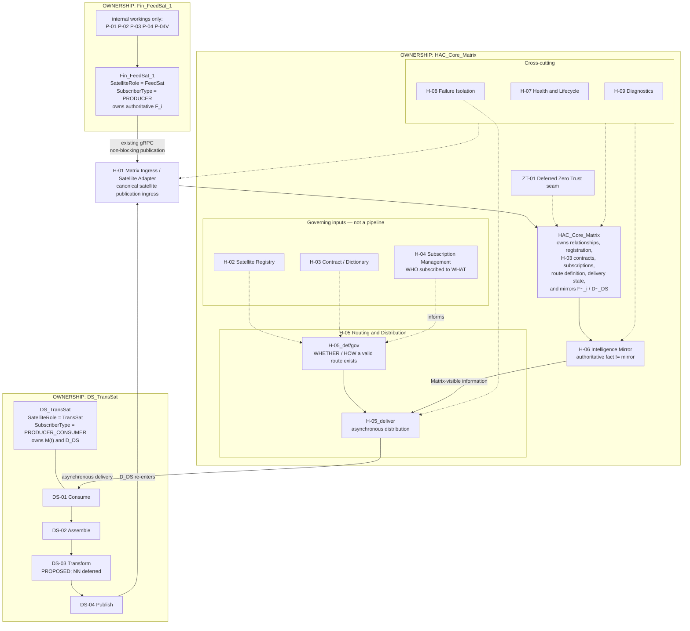
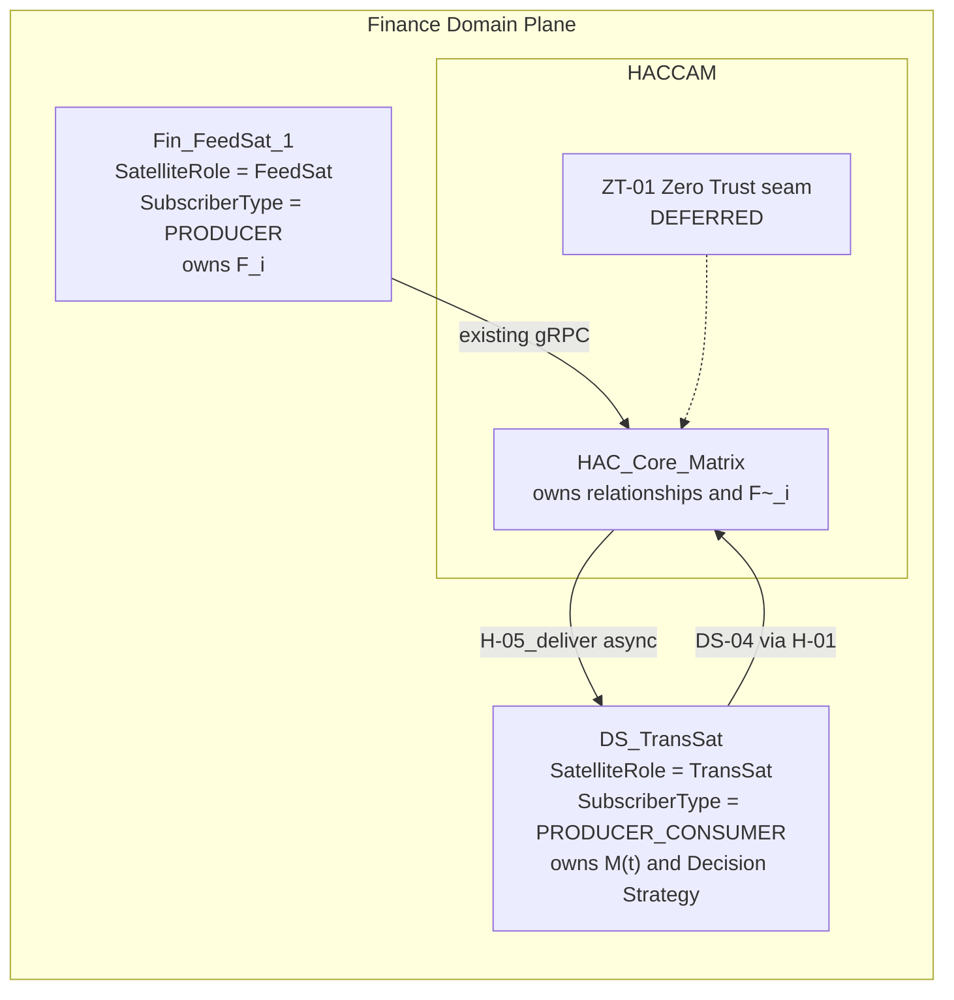
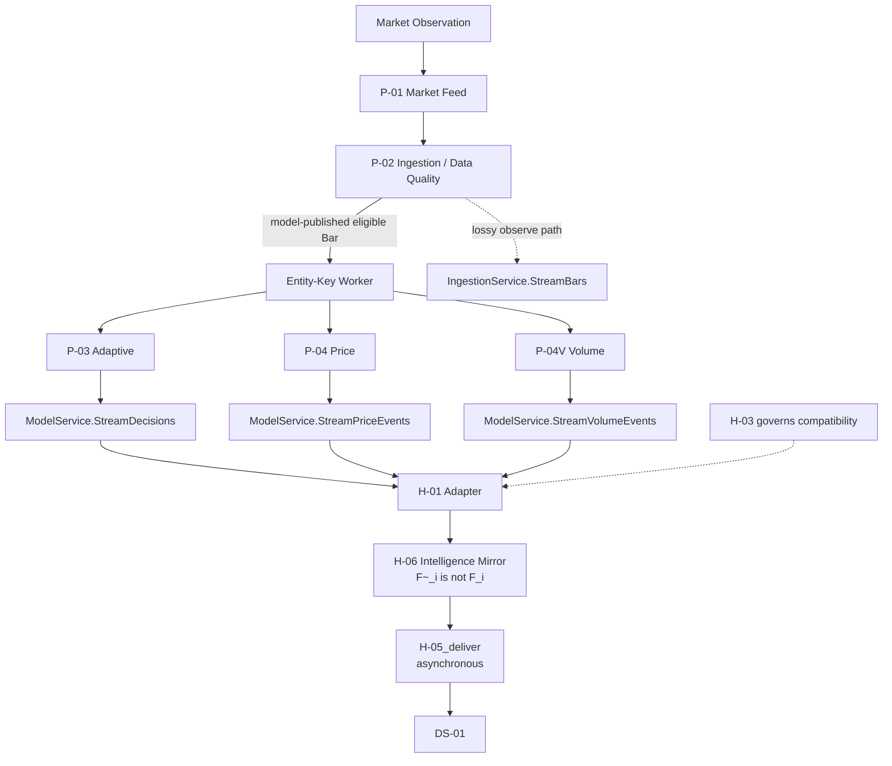
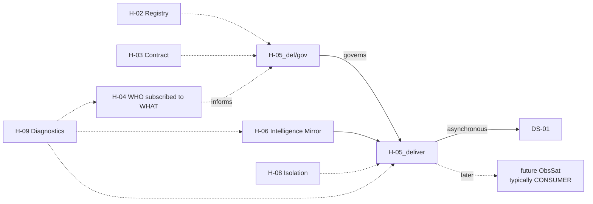
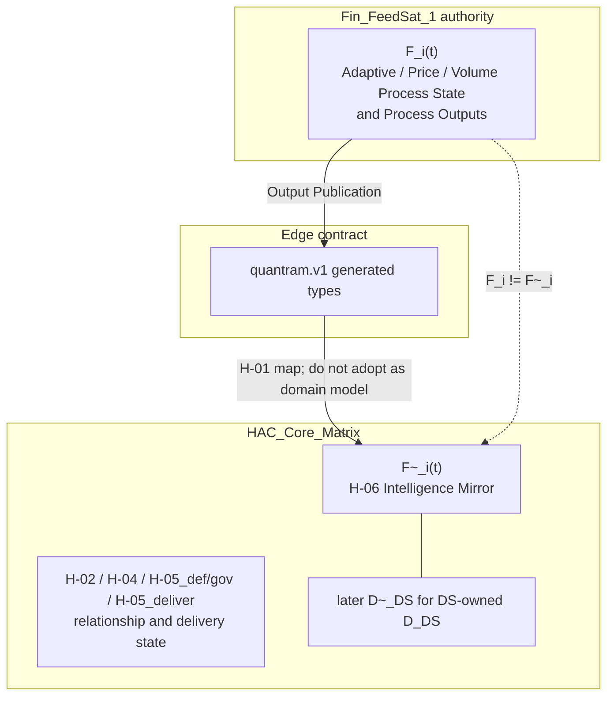
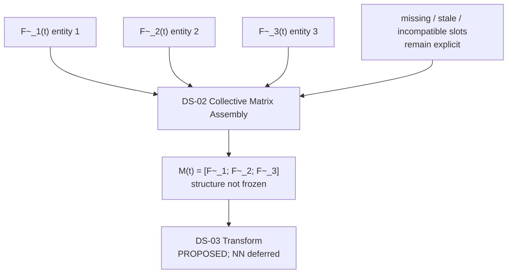
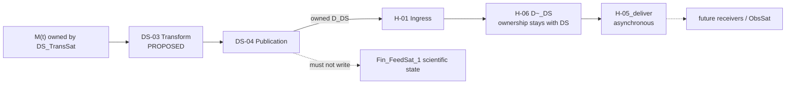
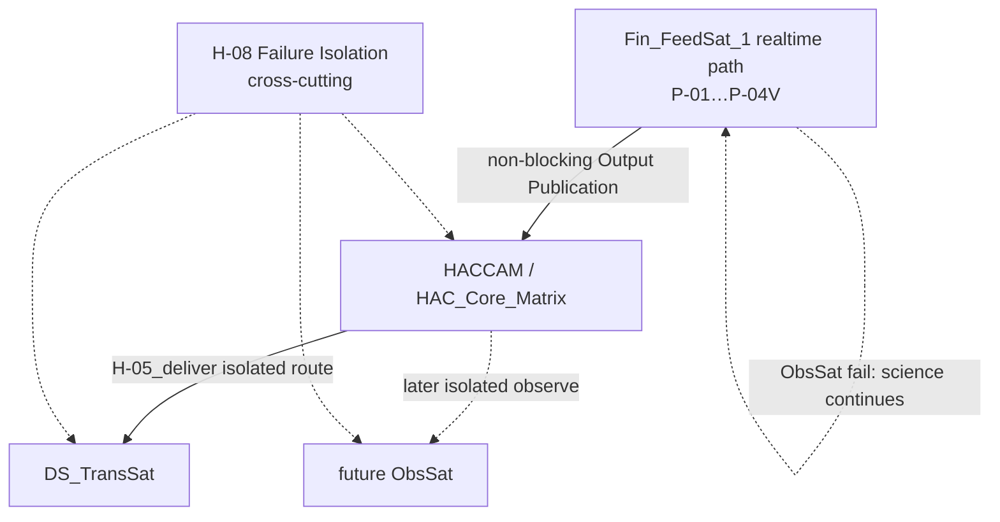

# HACCAM Process Model

**Title:** HACCAM Process Model V0.1  
**Document filename:** `HACCAM_PROCESS_MODEL_V0_1_090726.md`

## Date

2026-09-07

## Status

**PROPOSED FOR HUMAN REVIEW**

**Implementation:** NOT YET AUTHORIZED

This document is a design authority for the first HACCAM prototype process architecture. It does not authorize implementation, proto changes, QuanTRAM modification, Fin_FeedSat_1 creation, DS_TransSat code, Zero Trust, or neural-network work.

## Purpose

Define the first implementable HACCAM Process Model for Prototype V1: one Finance Domain FeedSat (`Fin_FeedSat_1`), one HACCAM core (`HAC_Core_Matrix` plus common satellite services), and one Decision Strategy TransSat (`DS_TransSat`).

The model exists so later implementation can proceed from named responsibilities, ownership, contracts, and failure behavior rather than from conceptual imagery or speculative final-system architecture.

## Scope

In scope:

- Prototype V1 process architecture for `Fin_FeedSat_1` + `HACCAM` / `HAC_Core_Matrix` + `DS_TransSat`
- factual relationship to the current QuanTRAM implementation, which is the authority for what `Fin_FeedSat_1` will initially contain
- existing QuanTRAM gRPC inventory and what HACCAM can actually consume today
- proposed HACCAM process inventory (new IDs, no collision with QuanTRAM `P-01`…`P-10`, `P-04V`, `C-01`)
- intelligence ownership, mirroring, FeedSat isolation, and noninterference
- required runtime and failure flows
- deferred Zero Trust seam and deferred Decision Strategy neural-network seam
- prototype validation requirements

Out of scope except as explicit seams or exclusions: implementation, proto creation/modification, QuanTRAM changes, copying QuanTRAM into `Fin_FeedSat_1`, Zero Trust implementation, neural-network design, Azure topology, broker/OMS/P&L architecture, orbital geometry semantics, and the final multi-domain HACCAM system.

## Executive Summary

HACCAM (High Assurance Core – Centralized Adaptive Model) is a domain-neutral federated architecture. Prototype V1 operates in the Finance Domain Plane and is deliberately small:

```text
Fin_FeedSat_1
        │ existing gRPC (non-blocking)
        ▼
H-01 Matrix Ingress
        ▼
HAC_Core_Matrix  (H-06 mirror → H-05_deliver, async)
        ▼
DS_TransSat  (DS-01…DS-04)
        │ Decision Strategy (DS-owned)
        ▼
H-01 Matrix Ingress
        ▼
HAC_Core_Matrix
```

`Fin_FeedSat_1` will initially be a controlled copy of current QuanTRAM and will retain QuanTRAM’s existing Finance Domain processes as-is: P-01 Market Feed, P-02 Ingestion, P-03 Adaptive, P-04 Price Engine, P-04V Volume Engine, Entity-Key Worker runtime, and the current gRPC surface. Those identifiers remain QuanTRAM/`Fin_FeedSat_1` identifiers. HACCAM does not renumber or redesign them.

Inspection of QuanTRAM HEAD `1e760ca54079ad92f9da8de3eba57c28bb0b8b3d` (2026-09-06) shows that HACCAM can begin as an adapter over existing services. Adaptive `DecisionEvent`, Price `PriceEvent`, Volume `VolumeEvent`, Bars, health/readiness, and the read-only semantic dictionary are already published. HACCAM does not own that intelligence. It owns the adapter, Satellite Registry, Contract / Dictionary interpretation, Subscription Management, Routing & Distribution, Intelligence Mirror, Health & Lifecycle, Failure Isolation, and Diagnostics.

`DS_TransSat` has `SatelliteRole = TransSat` and `SubscriberType = PRODUCER_CONSUMER`. Those two classifications are not the same concept. It consumes mirrored entity intelligence delivered asynchronously by H-05, assembles a collective matrix from the three `Fin_FeedSat_1` entities, applies a Prototype V1 Decision Strategy transform (DS-03, PROPOSED), and republishes the resulting Decision Strategy through H-01 into `HAC_Core_Matrix`. H-01 is the canonical Matrix ingress for satellite-produced HACCAM-visible information, not FeedSat-only ingress. The eventual neural-network implementation inside DS-03 is deferred. Zero Trust is deferred. Prototype V1 runs inside a trusted local development boundary and is not production-secure.

No Prototype V1 blocker was found that requires changing QuanTRAM scientific behavior before HACCAM adapter and mirror work can begin.

## Module/System Overview

```text
Finance Domain Plane
────────────────────────────────────────────────────────────────
  Fin_FeedSat_1                 HACCAM                    DS_TransSat
  FeedSat / PRODUCER            HAC_Core_Matrix           TransSat /
  (QuanTRAM as-is)              common satellite          PRODUCER_CONSUMER
                                services
  P-01…P-04V internal      H-01 Ingress (canonical;
                             FeedSat first, TransSat too)
                           H-02 Registry               DS-01 Consume
                           H-03 Contract / Dictionary  DS-02 Assemble
                           H-04 Subscriptions          DS-03 Transform
                           H-05 Routing & Distribution DS-04 Publish
                             H-05_def/gov + H-05_deliver
                           H-06 Intelligence Mirror
                           H-07 / H-08 / H-09
                             (cross-cutting)
                           ZT-01 Deferred Zero Trust
────────────────────────────────────────────────────────────────
```

Processes are logical responsibilities. This model does not require one executable, container, or repository per process.

## Inputs

| Input class | Source | Prototype V1 use |
| :--- | :--- | :--- |
| Existing FeedSat gRPC published information | `Fin_FeedSat_1` / current QuanTRAM `quantram.v1` | Adapter ingress; Intelligence Mirror candidates |
| FeedSat health and readiness | `OperationsService`, `MarketFeedService` | Health & Lifecycle; Diagnostics |
| Semantic dictionary | `SemanticService` | Contract / Dictionary interpretation only; never a FeedSat science lookup |
| Prototype configuration | local env / files | satellite identity, endpoint, three-entity universe, subscriptions |
| DS_TransSat Decision Strategy | `DS_TransSat` | H-01 re-ingress into `HAC_Core_Matrix`; DS remains owner |
| Conceptual topology | `HACCAM_prototype.png` | intended Prototype V1 topology only; does not override QuanTRAM facts |

## Outputs

| Output class | Owner | Meaning |
| :--- | :--- | :--- |
| Intelligence Mirror `F~_i(t)` / later `D~_DS(t)` | `HAC_Core_Matrix` (H-06) | Matrix-visible mirror of satellite-produced intelligence; not semantic owner |
| Route definition and delivery state | `HAC_Core_Matrix` (H-05) | H-05_def/gov owns permitted routes; H-05_deliver owns asynchronous delivery state |
| Collective Matrix `M(t)` | `DS_TransSat` (DS-02) | Assembled `[F~_1; F~_2; F~_3]`; structure not frozen |
| Decision Strategy `D_DS(t)` | `DS_TransSat` (DS-04) | New authoritative TransSat information. DS-03 is PROPOSED; neural-network implementation inside DS-03 is DEFERRED. |
| Diagnostics | H-09 | Routes, subscriptions, freshness, failures, participant health |
| Assurance / Zero Trust outputs | ZT-01 | None in Prototype V1; seam only |

## Parameters/Configuration

Prototype V1 freezes no HACCAM proto and no neural-network parameters. Implementable configuration classes:

| Parameter | Authority today | Prototype V1 note |
| :--- | :--- | :--- |
| `Fin_FeedSat_1` source commit | QuanTRAM HEAD at copy time | Current inspected HEAD: `1e760ca54079ad92f9da8de3eba57c28bb0b8b3d` |
| Entity universe | `QUANTRAM_SYMBOLS` | Current default is `AAPL` (one symbol). Multi-symbol is implemented (max 30). Prototype V1 **configures three entities**. Exact symbols are configuration, not architecture. Image examples (SPY / QQQ / DIA) are conceptual. |
| Adaptive enablement | `QUANTRAM_MODEL` | Default `off`. Adaptive streams require `adaptive`. |
| Price enablement | `QUANTRAM_PRICING` | Default `off`. Price streams require `expm` and Adaptive `adaptive`. |
| Volume enablement | none | Volume is wired whenever Adaptive Host is enabled. No `QUANTRAM_VOLUME` flag. |
| gRPC listen | `GRPC_PORT` | Default `50051`. |
| Market source | `QUANTRAM_SOURCE`, `QUANTRAM_FEED` | `alpaca`/`csv`; `iex`/`test`. |
| Model deadline | `QUANTRAM_MODEL_DEADLINE` | Default 200 ms; FeedSat-local. |
| HACCAM endpoint / identity | not implemented | PROPOSED local config. |
| Subscription set | not implemented | PROPOSED; initially Adaptive + Price + Volume + health. |
| Mirror freshness / stale threshold | not implemented | DEFERRED PENDING PROTOTYPE EVIDENCE. |
| Subscriber buffer policy | QuanTRAM `SubscriberQueue = 16` | FeedSat already drops slow gRPC consumers. HACCAM must not invert this. |

## Assumptions

- Current QuanTRAM is the implementation authority for initial `Fin_FeedSat_1` behavior.
- `Fin_FeedSat_1` will be a later controlled copy of current QuanTRAM; that copy has not been performed.
- Prototype V1 runs in a trusted local development boundary.
- Existing QuanTRAM gRPC is sufficient to begin HACCAM adapter and mirror work.
- Current Volume Engine code is used as-is; additional real-market validation remains desirable and does not block this Process Model.
- One process identifier names a durable functional responsibility, not a class, package, container, or binary.
- Generated protobuf types remain edge / boundary contracts. They are not the HACCAM internal domain model. Future HACCAM proto files, if authorized later, are implementation expressions of H-03, designed from prototype evidence rather than by copying QuanTRAM proto definitions.
- `SatelliteRole` and `SubscriberType` are distinct classifications. They are not combined into one field.
- Future N FeedSats are permitted; Prototype V1 has N = 1.
- Crossing the HACCAM boundary does not transfer semantic ownership of a satellite fact.

## Exclusions

- modification of QuanTRAM
- copying QuanTRAM into `Fin_FeedSat_1` during this design task
- HACCAM, `Fin_FeedSat_1`, or `DS_TransSat` implementation
- proto creation or modification
- Adaptive, Price, or Volume mathematics changes
- redesign of QuanTRAM P-05 or Process Model V2
- Zero Trust / mTLS / certificates / authorization / entitlements
- Decision Strategy neural-network topology, training, inference cadence, or trading objective
- direct FeedSat-to-FeedSat communication
- DS_TransSat feedback into FeedSat scientific state
- generalized Entity Key schema invention
- orbital radius / angle / distance semantics
- Azure, broker, OMS, ledger, or P&L architecture for completeness
- distributed exactly-once delivery claims

---

## 1. HACCAM system boundary

HACCAM is the home of:

- `HAC_Core_Matrix`
- common satellite services
- semantic and service relationships
- subscription management
- routing and distribution
- intelligence mirroring
- satellite lifecycle
- health
- failure isolation
- diagnostics
- later common security and assurance services

HACCAM is **not**:

- a Finance Domain scientific processor
- a replacement owner of FeedSat Adaptive / Price / Volume state
- merely a gRPC subscriber application
- a production-secure Zero Trust system in Prototype V1

**System boundary (PROPOSED):**

| Inside HACCAM | Outside HACCAM |
| :--- | :--- |
| Adapter, registry, contracts, subscriptions, routing, mirrors, health, isolation, diagnostics | `Fin_FeedSat_1` scientific processes and Process State |
| Delivery / relationship state | Market feed credentials and provider sessions |
| Mirrored intelligence `F~_i` | Authoritative FeedSat intelligence `F_i` |
| DS_TransSat consumption/publication relationships | DS_TransSat Decision Strategy ownership after publication |
| Deferred Zero Trust seam | Actual mTLS / policy / entitlement implementation |

## 2. Relationship to current QuanTRAM

Authority order used by this document:

```text
actual current QuanTRAM implementation/code
        ↓
validated tests / current behavior
        ↓
current / frozen QuanTRAM design documents
        ↓
historical QuanTRAM documents
        ↓
conceptual HACCAM material
```

Inspected QuanTRAM HEAD:

| Field | Value |
| :--- | :--- |
| Repository | `C:\Users\chino\QuanTRAM` |
| Commit | `1e760ca54079ad92f9da8de3eba57c28bb0b8b3d` |
| Date | 2026-09-06 13:23:12 -0700 |
| Subject | Quantam-HAC_cire design doc added |
| Branch | `main` |

QuanTRAM remains untouched. It is the implementation authority for what `Fin_FeedSat_1` will initially contain. HACCAM conceptual material, including `HACCAM_prototype.png`, must not override QuanTRAM facts.

QuanTRAM Process Model V2 remains the authority for `P-01`…`P-10`, `P-04V`, and `C-01`. This HACCAM Process Model does not modify V2.

Current QuanTRAM is a single Go binary (`quantram-server`) collocating P-01, P-02, P-03, P-04, P-04V, sideways StageTransition publication, and five implemented gRPC services. P-05 through P-10 are specified in V2 and are **not implemented**.

## 3. Fin_FeedSat_1

`Fin_FeedSat_1` is the first Finance Domain FeedSat.

| Fact | Status |
| :--- | :--- |
| Intended initial content | current QuanTRAM behavior as-is |
| Repository | `C:\Users\chino\Fin_FeedSat_1` exists and is Git-initialized |
| Copy of QuanTRAM | **not performed** |
| Scientific redesign | forbidden for Prototype V1 |
| Process IDs | retain QuanTRAM `P-01`, `P-02`, `P-03`, `P-04`, `P-04V`, and unimplemented `P-05`…`P-10`, `C-01` |

### 3.1 Existing Fin_FeedSat_1 domain processes

These are existing QuanTRAM processes. They are **not** HACCAM processes.

| ID | Process | Implementation today | Prototype V1 |
| :--- | :--- | :--- | :--- |
| P-01 | Market Feed | IMPLEMENTED | retain as-is |
| P-02 | Ingestion and Data Quality | IMPLEMENTED | retain as-is |
| P-03 | Adaptive Model Host | IMPLEMENTED; default `QUANTRAM_MODEL=off` | retain as-is; prototype runtime should enable `adaptive` to publish intelligence |
| P-04 | Price Engine | IMPLEMENTED; default `QUANTRAM_PRICING=off` | retain as-is; prototype runtime should enable `expm` |
| P-04V | Volume Engine | IMPLEMENTED; enabled when Adaptive Host is enabled | retain as-is, including current mathematics |
| P-05 | OMS and Risk | NOT IMPLEMENTED | out of Prototype V1 |
| P-06 | Execution | NOT IMPLEMENTED | out of Prototype V1 |
| P-07 | Live Execution Event Stream | NOT IMPLEMENTED | out of Prototype V1 |
| P-08 | Execution Ledger | NOT IMPLEMENTED | out of Prototype V1 |
| P-09 | Paper Simulation | NOT IMPLEMENTED | out of Prototype V1 |
| P-10 | Benchmark Analysis | NOT IMPLEMENTED | out of Prototype V1 |
| C-01 | Harness Dashboard | external client; not required | out of Prototype V1 |

P-03, P-04, and P-04V are sibling model-processing processes. They each consume the same model-published eligible Bar from P-02. They do **not** form `P-03 → P-04 → P-04V`. HACCAM must not invent that chain.

### 3.2 Three-entity runtime

Do **not** split the three entities into separate FeedSats.

```text
Fin_FeedSat_1
    ├── Entity 1
    ├── Entity 2
    └── Entity 3
```

**IMPLEMENTED fact:** QuanTRAM already supports a configurable multi-symbol universe (`QUANTRAM_SYMBOLS`, max 30). Each configured symbol has an Entity-Key Worker. Default configuration is one symbol (`AAPL`), not three.

**PROPOSED Prototype V1 configuration:** operate `Fin_FeedSat_1` with three configured entities. Exact symbols are configuration. Image labels such as SPY / QQQ / DIA are conceptual examples, not current hardcoded identity.

Current instrument classification (`domain.ClassifyInstrument`) defaults unknown symbols to `STOCK`. ETF/index classification is FeedSat-local and incomplete. HACCAM must treat `instrument_type` as FeedSat-supplied metadata, not as HACCAM science.

## 4. Finance Domain Plane

HACCAM is domain-neutral. Prototype V1 occupies the **Finance Domain Plane**.

| Term | Meaning in this model |
| :--- | :--- |
| Domain Field | the set of Domain Planes HACCAM may later host |
| Domain Plane | the domain-specific semantic orbit of participating satellites |
| Finance Domain Plane | the plane of this prototype; Finance semantics remain valid |
| Orbit | permitted semantic participation in a Domain Plane |

The Domain Plane defines the permitted semantic orbit of its satellites. Orbital radius, angle, and distance are **not** assigned quantitative meaning. They are not trust, latency, priority, processing power, or network distance.

Finance Domain names remain Finance names: Observation, Entity, Symbol, Adaptive, Price, Volume, Indicator. HACCAM does not rename these into artificial generic substitutes.

## 5. Satellite ontology

Canonical roles:

| Role | Name to use | Primary behavior |
| :--- | :--- | :--- |
| FeedSat | FeedSat | owns independent local domain intelligence; publishes authoritative intelligence it owns through HACCAM; peer-unaware |
| TransSat | TransSat | consumes Matrix-visible information; creates new authoritative information, decisions, or actions; republishes the resulting authoritative information through `HAC_Core_Matrix` |
| ObsSat | ObsSat | consumes Matrix-visible information for monitoring, benchmarking, reporting, audit, analysis; does not alter the causal transformation chain |

Do **not** use “Observer Satellite”. Do not redefine Observation.

Every HACCAM satellite participant also has an explicit `SubscriberType`. `SubscriberType` is **not** `SatelliteRole`. Do not combine them.

| SubscriberType | Meaning |
| :--- | :--- |
| `PRODUCER` | publishes authoritative information into HACCAM; does not consume Matrix-visible information as part of its role path |
| `CONSUMER` | consumes Matrix-visible information; does not create new authoritative information in the causal chain |
| `PRODUCER_CONSUMER` | consumes Matrix-visible information and publishes newly created authoritative information back through `HAC_Core_Matrix` |

`HAC_Core_Matrix` is not a satellite and does not receive a `SatelliteRole` or `SubscriberType`. H-04 subscriptions describe Matrix delivery relationships; they do not recast the core as a satellite.

Prototype V1 participants:

| Participant | SatelliteRole | SubscriberType | Domain Plane | Required in V1 |
| :--- | :--- | :--- | :--- | :--- |
| `Fin_FeedSat_1` | FeedSat | `PRODUCER` | Finance | yes |
| `HACCAM` / `HAC_Core_Matrix` | not a satellite | not a satellite | domain-neutral core operating a Finance Domain Plane prototype | yes |
| `DS_TransSat` | TransSat | `PRODUCER_CONSUMER` | Finance | yes |
| future monitoring satellite | ObsSat | typically `CONSUMER` | as assigned | no; common services must not preclude later ObsSat participation |

Satellites are dynamic state-bearing participants:

```text
S_i(t) → S_i(t + Δt)
```

They are not stationary microservice boxes.

## 6. FeedSat isolation

Mandatory:

```text
F_i  -/->  F_j     for i ≠ j
```

A FeedSat does not know peer FeedSat state, output, decisions, or intelligence. Collective awareness exists only downstream from mirrored intelligence.

Prototype V1 has N = 1. Isolation is still an architectural invariant so later N FeedSats do not require FeedSat-to-FeedSat links.

```text
Future:
FeedSat_1 ─┐
FeedSat_2 ─┼──> HAC_Core_Matrix ──> DS_TransSat
FeedSat_3 ─┤
...        │
FeedSat_N ─┘

Prototype V1:
Fin_FeedSat_1 ──> HAC_Core_Matrix ──> DS_TransSat
```

Do not introduce direct FeedSat-to-FeedSat communication. Do not introduce DS_TransSat feedback into FeedSat scientific state.

## 7. HAC_Core_Matrix

`HAC_Core_Matrix` is the central trusted operational construct inside HACCAM. CAM (Centralized Adaptive Model) centralizes the authoritative **system-level** model, not satellite computation.

Working definition:

> The Centralized Adaptive Model is the authoritative central model of a federated adaptive system, defining its domain semantics, service relationships, participant contracts and governed interactions while permitting model processing to be distributed across an elastic field of satellites.

`HAC_Core_Matrix` owns:

- semantic / service relationships
- participant registration state
- participant contracts
- Matrix definitions
- routing relationships
- subscriptions
- shared dictionary relationships
- governed interactions
- delivery state
- Intelligence Mirrors as Matrix-visible representations (`F~_i`, later `D~_DS`, and future satellite mirrors)
- route definition (H-05_def/gov) and route / delivery state (H-05_deliver)

`HAC_Core_Matrix` does **not** own:

- `Fin_FeedSat_1` Adaptive / Price / Volume Process State or other `F_i` facts
- DS_TransSat collective matrix `M(t)`
- DS_TransSat Decision Strategy `D_DS` after DS_TransSat creates it
- future Risk decisions, Execution actions/state, or Ledger / P&L facts
- Finance Domain mathematics

HACCAM does not become owner of a satellite fact merely because that fact crosses the HACCAM boundary. Routing, distribution, serialization, ingress, mirroring, or subscription do not transfer semantic ownership.

## 8. HACCAM process inventory

### 8.1 Naming convention (PROPOSED)

| Prefix | Owner class | Collision rule |
| :--- | :--- | :--- |
| `H-nn` | HAC_Core_Matrix / common satellite services | do not use `P-nn`, `P-04V`, or `C-01` |
| `DS-nn` | DS_TransSat | do not use QuanTRAM IDs |
| `ZT-nn` | deferred assurance / Zero Trust seam | not implemented in Prototype V1 |

All HACCAM IDs in this document are **PROPOSED**. They name durable functional responsibilities, not Go types, packages, executables, or containers.

### 8.2 Proposed HACCAM processes

The HACCAM inventory is a set of durable functional responsibilities. It is **not** a sequential pipeline. Do not read or implement:

```text
H-01 → H-02 → H-03 → H-04 → H-05 → H-06 → H-07 → H-08 → H-09
```

as a data-flow chain. H-01 is the canonical Matrix ingress for satellite-produced HACCAM-visible information. H-02, H-03, and H-04 govern identity, contracts, and subscription intent. H-05 is one durable process with two subordinate aspects: H-05_def/gov (route definition / governance) and H-05_deliver (asynchronous routing / distribution execution). H-06 owns mirrored representations of satellite-produced information without taking semantic ownership. H-07, H-08, and H-09 are cross-cutting. ZT-01 is a deferred assurance seam. DS-01 through DS-04 are the TransSat causal path.

| Process ID | Process name | Owner | Relationship class | Implementation status |
| :--- | :--- | :--- | :--- | :--- |
| H-01 | Matrix Ingress / Satellite Adapter | HACCAM | canonical satellite ingress | PROPOSED |
| H-02 | Satellite Registry | HACCAM | governing / supporting | PROPOSED |
| H-03 | Contract / Dictionary | HACCAM | governing / supporting | PROPOSED |
| H-04 | Subscription Management | HACCAM | governing / supporting | PROPOSED |
| H-05 | Routing & Distribution | HACCAM | governance + asynchronous distribution | PROPOSED |
| H-05_def/gov | Routing Definition / Governance | HACCAM | subordinate aspect of H-05 | PROPOSED |
| H-05_deliver | Asynchronous Routing / Distribution Execution | HACCAM | subordinate aspect of H-05 | PROPOSED |
| H-06 | Intelligence Mirror | HACCAM | mirroring | PROPOSED |
| H-07 | Health & Lifecycle | HACCAM | cross-cutting | PROPOSED |
| H-08 | Failure Isolation | HACCAM | cross-cutting | PROPOSED |
| H-09 | Diagnostics | HACCAM | cross-cutting | PROPOSED |
| ZT-01 | Deferred Assurance / Zero Trust Boundary | HACCAM (future) | deferred assurance seam | DEFERRED |
| DS-01 | Mirrored Intelligence Consumption | DS_TransSat | TransSat causal path | PROPOSED |
| DS-02 | Collective Matrix Assembly | DS_TransSat | TransSat causal path | PROPOSED |
| DS-03 | Decision Strategy Transform | DS_TransSat | TransSat causal path | PROPOSED |
| DS-04 | Decision Strategy Publication | DS_TransSat | TransSat causal path | PROPOSED |

H-05_def/gov and H-05_deliver are **not** new top-level process IDs. They are named subordinate functional aspects of the single durable process H-05 Routing & Distribution. Do not implement them as H-05A / H-05B or as separate executables merely because they are named.

DS-03 itself is **PROPOSED**. Prototype V1 may use a deterministic or test transformation to prove:

```text
CONSUME → ASSEMBLE → TRANSFORM → PUBLISH
```

Only the eventual neural-network implementation inside DS-03 is **DEFERRED**. Do not classify DS-03 as deferred.

See Table B for the full inventory.

### 8.3 Master HACCAM Process Model diagram

This is the master end-to-end Process Model. QuanTRAM `P-` processes appear only as internal workings of `Fin_FeedSat_1`. Ownership boundaries are the primary structure.



How to read the diagram:

1. `Fin_FeedSat_1` owns local authoritative intelligence `F_i`. Its P-processes remain FeedSat-internal.
2. H-01 is the canonical Matrix ingress for satellite-produced HACCAM-visible information. Prototype V1 first implements the FeedSat-facing adapter. Architecturally H-01 is satellite-role-neutral and also receives DS-04.
3. `HAC_Core_Matrix` owns Matrix relationships, H-03 contracts, subscriptions, route definition, delivery state, and mirror objects. It does not own `F_i` or `D_DS`.
4. H-02, H-03, and H-04 inform H-05_def/gov. They are not runtime message-passing stages and do not form H-01…H-09 sequence.
5. H-05 is one process: H-05_def/gov determines permitted delivery relationships; H-05_deliver executes them asynchronously. Neither changes semantic ownership.
6. H-06 holds Matrix-visible mirrors of satellite-produced information. `F_i ≠ F~_i`. Later `D_DS ≠ D~_DS`.
7. Runtime path to DS-01 is H-06 → H-05_deliver → DS-01, not H-06 → DS-01.
8. H-08 isolates slow or failed H-05_deliver receivers without blocking H-01, H-06, unrelated routes, or FeedSat science.
9. H-07 / H-09 are cross-cutting. ZT-01 is a deferred seam.
10. `DS_TransSat` owns `M(t)` and Decision Strategy `D_DS`. DS-04 republishes through H-01. HACCAM then owns only ingress mapping, optional `D~_DS`, route, and delivery state.

## 9. Process ownership

**ONE OWNER PER FACT.** A fact that crosses the HACCAM boundary does not change owner.

| Fact | Authoritative owner | Not the owner |
| :--- | :--- | :--- |
| Market Observation / Bar | `Fin_FeedSat_1` P-01 / P-02 | HACCAM |
| Adaptive Process State and `DecisionEvent` | `Fin_FeedSat_1` P-03 | HACCAM, DS_TransSat |
| Price Process State and `PriceEvent` | `Fin_FeedSat_1` P-04 | HACCAM, DS_TransSat |
| Volume Process State and `VolumeEvent` | `Fin_FeedSat_1` P-04V | HACCAM, DS_TransSat |
| FeedSat-local gRPC / proto edge contract | `Fin_FeedSat_1` / QuanTRAM proto | HACCAM internal domain model |
| HACCAM-visible interface contracts, versions, compatibility | H-03 | FeedSat scientific implementation; generated proto structs |
| Adapter mapping / ingress generation | H-01 | producing satellite science |
| Satellite identity / `SatelliteRole` / `SubscriberType` / endpoint | H-02 | FeedSat science |
| Subscription set (who is subscribed to what) | H-04 | FeedSat; H-05 |
| Route definition (whether / how a valid route exists) | H-05_def/gov | H-04; producing satellites |
| Asynchronous delivery state | H-05_deliver | producing satellites |
| Intelligence Mirror `F~_i`, later `D~_DS` | H-06 | producing satellite. Authority of the mirrored fact remains with that satellite. |
| Participant health view | H-07 | not a substitute for FeedSat-owned health facts |
| Isolation / drop / shed decisions | H-08 | FeedSat realtime path |
| Diagnostic visibility | H-09 | not authoritative intelligence |
| Collective Matrix `M(t)` | DS_TransSat / DS-02 | HACCAM, FeedSat |
| Decision Strategy `D_DS` | DS_TransSat / DS-04 | HACCAM, FeedSat |
| Future Risk decision | future Risk TransSat | HACCAM; FeedSat |
| Future Execution action / state | future Execution TransSat | HACCAM; FeedSat |
| Future Ledger / P&L fact | future Ledger TransSat | HACCAM; FeedSat |
| Zero Trust policy | ZT-01 (future) | none in V1 |

## 10. Process inputs / outputs

See Table B. Prototype V1 has **two causal paths** and a surrounding Matrix. It does not have one H-process pipeline.

**FeedSat-local causal path** (unchanged QuanTRAM science):

```text
Observation
  → Fin_FeedSat_1 P-01 / P-02
  → sibling P-03 / P-04 / P-04V Process Outputs
  → existing gRPC Output Publication
```

**Matrix ingress, mirror, and asynchronous delivery** (HACCAM-owned representations, not satellite ownership):

```text
existing gRPC or TransSat publication
  → H-01 Matrix Ingress
  → HAC_Core_Matrix
        H-03 governs interpretation / compatibility
        H-02 identifies the participant
        H-04 records who is subscribed to what
        H-05_def/gov determines whether / how a valid route exists
        H-06 holds F~_i (and later D~_DS)
        H-05_deliver distributes Matrix-visible information asynchronously
```

**DS_TransSat causal path** (new authoritative Decision Strategy):

```text
H-05_deliver  →  DS-01 consume
              →  DS-02 assemble
              →  DS-03 transform   (PROPOSED; neural network DEFERRED)
              →  DS-04 publish
              →  H-01 Matrix Ingress
              →  HAC_Core_Matrix   (mirror / route / delivery only; DS_TransSat still owns D_DS)
```

H-07, H-08, and H-09 are cross-cutting across ingress, Matrix, and routes. ZT-01 is a deferred seam. H-02, H-03, and H-04 inform H-05_def/gov; they are not runtime message-passing stages and not a sequential chain after H-01.

## 11. Existing gRPC integration boundary

Initial integration:

```text
Existing FeedSat gRPC Contract
        ↓
  H-01 Matrix Ingress / Satellite Adapter
        ↓
  H-06 Intelligence Mirror
        ↓
  H-05_deliver  (asynchronous)
```

H-01 is the canonical Matrix ingress responsibility for satellite-produced HACCAM-visible information. Prototype V1 first implements the FeedSat-facing adapter over the existing QuanTRAM gRPC edge contract, but H-01 is not architecturally limited to FeedSat ingress. TransSat-produced information, including DS-04 Decision Strategy publication, re-enters `HAC_Core_Matrix` through H-01 under the applicable H-03 contract.

The adapter belongs in HACCAM. Do not modify `Fin_FeedSat_1` to make integration easier. Do not invent a separate TransSat publication ingress at this stage.

### 11.1 Implemented QuanTRAM services (AVAILABLE NOW)

Registered by `cmd/quantram-server/main.go`:

| Service | RPCs | Transport |
| :--- | :--- | :--- |
| `MarketFeedService` | `GetFeedHealth`, `GetActiveSource` | unary |
| `IngestionService` | `StreamBars`, `GetBarWindow`, `TriggerGapFill` | stream / unary / unary |
| `OperationsService` | `GetHealth`, `GetReadiness` | unary |
| `ModelService` | `StreamDecisions`, `StreamPriceEvents`, `StreamVolumeEvents` | server streams |
| `SemanticService` | `GetTerm`, `ListTerms`, `GetSemanticContract` | unary read-only |

### 11.2 Intelligence availability classification

| Information | Classification | Evidence |
| :--- | :--- | :--- |
| Entity / symbol identity | AVAILABLE NOW | `symbol` on Bar, DecisionEvent, PriceEvent, VolumeEvent; `instrument_id` on Bar |
| Adaptive output | AVAILABLE NOW | `ModelService.StreamDecisions` → `DecisionEvent` (decision or skip) |
| Adaptive internal Process State | NOT EXPOSED | only `pre_state_hash` / `post_state_hash` on the event |
| Price categorical output / cockpit | AVAILABLE NOW | `StreamPriceEvents` → `PriceEvent.emission` / `cockpit` / skip |
| Price scientific scalars `P`, `P1`, `P2`, projected trajectory | NOT EXPOSED | present on internal `domain.PriceEmission`; absent from proto `PriceEmission` |
| Volume output / Indicator / quantities | AVAILABLE NOW | `StreamVolumeEvents` → `VolumeEvent` |
| Volume wired independently of Adaptive | NOT APPLICABLE | Volume is enabled when Adaptive Host is enabled |
| Indicator (Volume) | AVAILABLE NOW | `VolumeEmission.indicator` and `raw_color` |
| `source_timestamp` | AVAILABLE NOW | Bar, DecisionEvent, PriceEvent, VolumeEvent |
| `interval_start` / `interval_end` | PARTIALLY AVAILABLE | both on Bar and VolumeEvent; DecisionEvent/PriceEvent expose interval start only |
| `market_snapshot_id` | AVAILABLE NOW | Bar and all three model events |
| `accepted_sequence` | AVAILABLE NOW | per-process publication cursor on model events; not a global generation |
| `event_id` | AVAILABLE NOW | all three model events |
| EffectiveTime | NOT EXPOSED on gRPC model events | exists internally in StageTransition; Volume has no independent EffectiveTime |
| Process status per entity | PARTIALLY AVAILABLE | Host `SymbolHealth` exists internally; no per-entity status RPC |
| Health | PARTIALLY AVAILABLE | unary `GetHealth` reports marketfeed, ingestion, model, pricing — **not volume** |
| Readiness `observe` / `infer` | AVAILABLE NOW | `GetReadiness` |
| Capabilities matrix | NOT EXPOSED | V2 proposes `GetCapabilities`; not implemented |
| Heartbeat stream | NOT EXPOSED | unary health only; V2 `StreamFeedHealth` not implemented |
| Semantic dictionary | AVAILABLE NOW | `SemanticService`; explains vocabulary; does not drive science |
| StageTransition events | NOT EXPOSED | internal hub + TXT diagnostic; no proto |
| Durable history / snapshot RPC | NOT EXPOSED | last-per-symbol catch-up on stream subscribe only |
| `VolumeEvent.latency_ms` | PARTIALLY AVAILABLE | field exists on proto; `toProtoVolumeEvent` does not populate it |
| Evaluate / GetModelInfo | NOT EXPOSED | proposed in V2; not in current proto |
| P-05…P-10 services | NOT EXPOSED | not implemented |

### 11.3 FeedSat publication behavior that HACCAM must respect

- Model streams are fan-out from Host `emit` / `emitPrice` / `emitVolume`.
- Subscriber buffers are bounded (`config.SubscriberQueue = 16`).
- A full subscriber channel **drops that event and logs**; the producer does not block. Validated by Host emit `select/default` and `TestG36SlowVolumeSubscriberDoesNotBlock`.
- Stream RPCs send last-per-symbol catch-up, then live events. This is not durable history and not exactly-once.
- Observe `StreamBars` is a **lossy** drop-oldest path. It is not the model-consumer path. HACCAM must not treat observe Bars as authoritative model intelligence.
- `TriggerGapFill` is an operator mutation. Prototype V1 HACCAM must not call it as part of mirroring.

See Table D.

## 12. Contract / Dictionary (H-03)

H-03 is **not** the proto file.

Working definition:

> H-03 Contract / Dictionary is the authoritative HACCAM function governing the semantic definitions, HACCAM-visible interface contracts, identifiers, versions, compatibility rules, Domain Plane vocabulary, participant classifications, definitions of HACCAM-visible information and governed interaction semantics by which HACCAM participants publish, discover, consume, transform and republish information.

H-03 governs **HACCAM-visible** contracts. It does not govern arbitrary satellite-internal interfaces or scientific implementation. `Fin_FeedSat_1` Adaptive, Price, and Volume mathematics remain satellite-local. QuanTRAM `quantram.v1` generated types remain that FeedSat’s current edge contract.

Architectural direction (do not reverse):

```text
SEMANTIC CONCEPT
        ↓
OWNERSHIP
        ↓
PARTICIPANT CONTRACT
        ↓
MESSAGE / TYPE
        ↓
SERVICE / RPC
        ↓
PROTO DEFINITION
```

Do not design HACCAM around arbitrary existing RPCs and then treat those RPCs as the architecture. Current QuanTRAM RPCs are the **first usable edge** for H-01. They are evidence, not the HACCAM internal model.

Future HACCAM protobuf files, if later authorized, are implementation expressions of H-03. Generated protobuf types remain **EDGE / BOUNDARY CONTRACTS**. They do not become HACCAM’s internal domain model. The eventual HACCAM proto should be designed from prototype evidence rather than by blindly copying QuanTRAM proto definitions.

Prototype V1:

- inspect and interpret the existing `quantram.v1` edge contract and `SemanticService` dictionary (`quantram_semantics_v1.json` version `1.0`)
- record contract name/version/date/status from `GetSemanticContract`
- classify definitions (Table E) as FeedSat-local, HACCAM-visible candidates, deferred/future satellite-local, or genuinely historical
- do **not** create a HACCAM proto in this increment
- do **not** introduce realtime dictionary lookup into FeedSat scientific processing

SHARED CANONICAL CANDIDATE does not mean “already a HACCAM contract.” It means the definition is a candidate for later H-03 ownership after prototype evidence.

H-03 informs H-01 mapping and H-05_def/gov compatibility. It is not a runtime hop in H-05_deliver.

## 13. Satellite Registry (H-02)

H-02 represents participating satellites and their roles, subscriber types, and capabilities. It is a governing Matrix function, not a stage after H-01. H-02 participant identity informs H-05_def/gov. It does not deliver information.

Prototype V1 may be **configured**, not network-discovered.

Minimum registered facts (PROPOSED):

| Field | Prototype V1 example |
| :--- | :--- |
| satellite identity | `Fin_FeedSat_1`, `DS_TransSat` |
| `SatelliteRole` | FeedSat, TransSat |
| `SubscriberType` | `PRODUCER`, `PRODUCER_CONSUMER` |
| Domain Plane | Finance Domain Plane |
| endpoint | `Fin_FeedSat_1` gRPC address |
| advertised information | DecisionEvent, PriceEvent, VolumeEvent; optional Bar / Health / Readiness / SemanticContract |
| contract family / version | current FeedSat edge: `quantram.v1` / semantic contract `1.0` |
| lifecycle | configured / connecting / connected / degraded / disconnected / failed |

`SatelliteRole` and `SubscriberType` are stored as separate fields. ObsSat is representable later without a V1 instance (`SatelliteRole = ObsSat`, typically `SubscriberType = CONSUMER`).

## 14. Subscription Management (H-04)

H-04 defines **who is subscribed to what**. It is a governing function, not a runtime message-passing stage. It does not change a satellite’s `SubscriberType`. It does not itself deliver information.

Distinguish:

| Concept | Meaning |
| :--- | :--- |
| `SubscriberType` | satellite classification: `PRODUCER`, `CONSUMER`, or `PRODUCER_CONSUMER` |
| H-04 subscription | subscription intent: who is configured to receive which Matrix-visible information |
| H-05_def/gov | whether / how that subscribed relationship forms a valid governed route |
| H-05_deliver | the actual asynchronous delivery |

```text
H-04 Subscription Management
        │ informs
        ▼
H-05_def/gov
        │ governs
        ▼
H-05_deliver
        │ asynchronous
        ▼
subscriber receiver
```

Do not make H-04 → H-05 a mandatory synchronous pipeline. H-04 informs H-05_def/gov; H-05_deliver executes later, asynchronously, when Matrix-visible information is available.

H-01 consuming `Fin_FeedSat_1` gRPC is adapter ingress over a FeedSat-local edge contract. That does not make `HAC_Core_Matrix` a satellite with `SubscriberType = CONSUMER`.

Prototype V1 Matrix subscriptions (PROPOSED):

| Receiver | Information | Source | Notes |
| :--- | :--- | :--- | :--- |
| H-01 ingress | `StreamDecisions` | `Fin_FeedSat_1` | edge consume; FeedSat remains `PRODUCER` |
| H-01 ingress | `StreamPriceEvents` | `Fin_FeedSat_1` | same |
| H-01 ingress | `StreamVolumeEvents` | `Fin_FeedSat_1` | same |
| H-07 | `GetHealth`, `GetReadiness`, `GetFeedHealth` | `Fin_FeedSat_1` | unary poll; cadence DEFERRED PENDING PROTOTYPE EVIDENCE |
| H-03 | `GetSemanticContract` / `ListTerms` | `Fin_FeedSat_1` | startup / compatibility, not per-observation |
| `DS_TransSat` | mirrored Adaptive / Price / Volume per entity | `HAC_Core_Matrix` | satellite subscription; DS remains `PRODUCER_CONSUMER` |

`StreamBars` (observe) is optional diagnostic input, not a required Decision Strategy input.

Filters: entity/symbol list and information type. More sophisticated topic languages are DEFERRED PENDING PROTOTYPE EVIDENCE.

## 15. Routing & Distribution (H-05)

H-05 is one durable top-level HACCAM process. It is **not** merely governing / supporting. Its relationship class is **governance + asynchronous distribution**.

It has two explicitly distinguishable subordinate responsibilities. They are **not** new top-level process IDs.

### 15.1 H-05_def/gov — Routing Definition / Governance

H-05_def/gov:

- determines valid source-to-receiver relationships
- applies H-02 participant identity
- applies H-03 contract / compatibility rules
- applies H-04 subscription relationships
- determines which information may be routed
- maintains route definition / route governance
- does **not** itself imply synchronous delivery

H-05 does not invent routing semantics. H-03 defines the HACCAM-visible semantic / interface contract. H-02 identifies the participant. H-04 identifies subscription intent. H-05_def/gov combines those governed facts to establish a valid delivery relationship:

```text
H-02 participant identity
H-03 contract / compatibility
H-04 subscription
        │
        ▼
H-05_def/gov
        │
        ▼
H-05_deliver
```

This is a governance relationship, not a synchronous runtime chain.

### 15.2 H-05_deliver — Asynchronous Routing / Distribution Execution

H-05_deliver:

- performs runtime asynchronous delivery
- distributes Matrix-visible information to subscribed receivers
- supports fan-out
- delivers to TransSat and future ObsSat receivers
- must isolate slow / failed receivers, with H-08
- records or updates delivery state
- must not block upstream satellite scientific processing
- must preserve semantic ownership of the delivered information

Runtime path from Matrix-visible information to a subscriber receiver:

```text
H-06 Intelligence Mirror
        ↓
H-05_deliver
        ↓ asynchronous
DS-01  (or later ObsSat / other subscribed receivers)
```

Do **not** invent a concrete queue size, broker, channel, retry count, or backpressure algorithm here. Those remain implementation decisions / prototype evidence.

### 15.3 Ownership and Prototype V1 routes

**HACCAM-INV-19:** H-05_def/gov determines permitted delivery relationships. H-05_deliver executes those relationships asynchronously. Neither function changes semantic ownership of the information being delivered.

Prototype V1 routes:

1. H-01 adapted `Fin_FeedSat_1` intelligence → H-06 mirrors (`F~_i`)
2. H-06 → H-05_deliver → `DS_TransSat` (DS-01)
3. DS-04 Decision Strategy → H-01 → H-06 (`D~_DS` where needed) → H-05_deliver to any subscribed downstream receivers. `DS_TransSat` remains owner of `D_DS`.

Fan-out must not require FeedSat peer awareness. A slow or failed receiver is isolated by H-08 and must not block H-01, H-06, unrelated routes, or FeedSat science.

Exactly-once, durable bus, and replay semantics are **not** claimed. Current FeedSat publication is bounded, lossy-on-slow-subscriber, last-per-symbol catch-up. HACCAM must not invert that property.

## 16. Intelligence Mirroring (H-06)

H-06 remains **Intelligence Mirror**. The name already supports more than FeedSat intelligence. Architecturally:

```text
satellite-produced authoritative information
        ↓
HACCAM-managed downstream mirror
```

Keep the FeedSat model:

```text
F_i(t)   = authoritative Fin_FeedSat_1 intelligence
F~_i(t)  = HACCAM mirrored representation
F_i ≠ F~_i
```

General ownership rule: **authoritative satellite fact ≠ HACCAM mirror of that fact**.

For `DS_TransSat`, conceptually (not an implementation API):

```text
D_DS(t)    = authoritative DS_TransSat Decision Strategy
D~_DS(t)   = HACCAM-managed Matrix mirror
D_DS ≠ D~_DS
```

H-06 may hold Matrix-visible representations of:

- FeedSat intelligence
- DS_TransSat Decision Strategy
- future Risk TransSat outputs
- future Execution TransSat outputs where appropriate
- future Ledger TransSat outputs where appropriate

without becoming the semantic owner. H-06 owns the mirror object. The producing satellite remains owner of the intelligence.

Prototype V1 first objective: three traceable `Fin_FeedSat_1` entity mirrors, each able to hold Adaptive, Price, and Volume information when those streams are enabled. DS Decision Strategy mirroring is in scope as soon as DS-04 publishes through H-01.

Prototype V1 mirror grain (PROPOSED): one mirror object per `(satellite, entity, information type)`.

Do **not** force mirror rows to have identical timestamps. Do **not** invent, in this Process Model:

- synchronization windows
- temporal alignment algorithms
- half-life weighting
- freshness weighting
- tolerance windows

Those decisions, if needed, must emerge from prototype evidence. Prototype V1 may retain latest-known per-`(entity, information type)` values and mark missing or stale slots explicitly.

Minimum provenance to retain when the existing contract supplies it:

| Provenance | Available now |
| :--- | :--- |
| producing satellite | HACCAM-assigned (`Fin_FeedSat_1`); not a FeedSat field |
| entity / symbol | yes |
| information type | yes (event message type) |
| `event_id` | yes |
| `market_snapshot_id` | yes |
| `source_timestamp` | yes |
| `interval_start` | yes |
| `accepted_sequence` | yes |
| contract / schema version | Adaptive `schema_version` / `model_version`; semantic contract version via SemanticService; Price/Volume schema version **NOT EXPOSED** as first-class proto fields |
| EffectiveTime | NOT EXPOSED on model gRPC events |
| mirror receipt time | HACCAM-owned (PROPOSED) |
| freshness / stale flag | HACCAM-owned (PROPOSED); threshold DEFERRED PENDING PROTOTYPE EVIDENCE |

Durable mirror history is optional and DEFERRED. Latest-state in-memory mirrors are sufficient to start.

H-06 supplies Matrix-visible mirrored information to H-05_deliver. It does not itself perform subscriber delivery.

HACCAM must not fabricate continuity when information is dropped, stale, missing, or incompatible.

## 17. Health & Lifecycle (H-07)

H-07 is **cross-cutting**. It is not a stage after H-06 and not part of the DS causal path.

H-07 represents participant connectivity, health, and lifecycle.

FeedSat-local health remains owned by `Fin_FeedSat_1`. H-07 owns the HACCAM view of participants.

Prototype V1 sources:

| Source | What it provides | Gap |
| :--- | :--- | :--- |
| `GetFeedHealth` | source, feed state, last message, heartbeat failures, subscribed symbols | unary; not a stream |
| `GetActiveSource` | active source id/state | unary |
| `GetHealth` | aggregate plus marketfeed, ingestion, model, pricing | volume component absent |
| `GetReadiness` | ready / observe / infer | not a capability matrix |
| gRPC stream liveness | adapter connected or not | not a FeedSat scientific signal |

Lifecycle states (PROPOSED): `configured`, `connecting`, `connected`, `degraded`, `disconnected`, `failed`. Recovery policy beyond reconnect/explicit failure reporting is DEFERRED PENDING PROTOTYPE EVIDENCE.

## 18. Failure Isolation (H-08)

H-08 is **cross-cutting**. It applies to ingress, Matrix routes, and TransSat/ObsSat consumers. It is not a sequential process after H-07.

H-08 prevents a failed or slow HACCAM receiver from interfering with FeedSat realtime processing, H-01 ingress, H-06 mirror updates, or unrelated H-05 routes.

H-05_deliver is asynchronous / non-blocking by architecture. H-08 must be able to isolate:

- slow TransSat receivers
- failed TransSat receivers
- future slow or failed ObsSat receivers
- failed downstream routes

without blocking:

- H-01 ingress
- H-06 mirror updates
- unrelated routes
- FeedSat realtime scientific processing

Do not invent a concrete queue size, broker, channel, retry count, or backpressure algorithm in this Process Model.

Grounded in current QuanTRAM behavior:

- Host model/price/volume emit uses non-blocking send; slow gRPC clients cannot block ModelHost
- observe `StreamBars` is separately lossy
- HACCAM must preserve this direction: HACCAM is an optional consumer of FeedSat Output Publication

Prototype V1 isolation rules:

1. HACCAM failure must not alter `Fin_FeedSat_1` Process State.
2. DS_TransSat failure must not alter `Fin_FeedSat_1` Process State.
3. Future ObsSat failure must not alter `Fin_FeedSat_1` Process State.
4. A slow DS_TransSat or other H-05_deliver receiver must not block H-01, H-06, or unrelated routes.
5. HACCAM satellite boundaries remain asynchronous and non-blocking.
6. Drops, stalls, disconnects, and incompatibilities are explicit diagnostic facts.
7. Do not claim exactly-once or lossless reconnect.
8. Do not weaken the current QuanTRAM ModelHost bounded-drop protection against slow gRPC consumers.

Sophisticated recovery is DEFERRED PENDING PROTOTYPE EVIDENCE.

## 19. Diagnostics (H-09)

H-09 is **cross-cutting**. It makes routes, subscriptions, mirror freshness, failures, and participant health visible during development. Diagnostic loss must not become a control path into FeedSat science.

Minimum visible facts (PROPOSED):

- registered satellites, `SatelliteRole`, and `SubscriberType`
- active subscriptions and routes
- last mirror update per `(entity, information type)`
- stale / missing mirror flags
- adapter disconnects
- dropped deliveries
- contract mismatch / unknown entity / unknown information type
- participant health snapshot

Implementation form (log, file, RPC, UI) is DEFERRED. Visibility is required; the surface is not frozen.

## 20. DS_TransSat

`DS_TransSat` is the Decision Strategy TransSat.

| Classification | Value |
| :--- | :--- |
| `SatelliteRole` | TransSat |
| `SubscriberType` | `PRODUCER_CONSUMER` |

It consumes mirrored intelligence delivered asynchronously by H-05_deliver and publishes new Decision Strategy information back through H-01 into `HAC_Core_Matrix`. Role and subscriber type remain distinct: being a TransSat does not automatically mean `PRODUCER_CONSUMER`. This instance is `PRODUCER_CONSUMER` because of its actual relationship. Do not impose that every future TransSat must be `PRODUCER_CONSUMER`.

```text
H-06 → H-05_deliver  (asynchronous)
      ↓
 DS-01 consume
      ↓
 DS-02 assemble
      ↓
 DS-03 transform     (PROPOSED; neural network DEFERRED)
      ↓
 DS-04 publish
      ↓
 H-01 Matrix Ingress
      ↓
 HAC_Core_Matrix     (H-06 D~_DS where needed; H-05_deliver to later receivers)
```

`DS_TransSat` is not part of `Fin_FeedSat_1`. It must not cause FeedSat scientific changes. It owns `M(t)` and Decision Strategy `D_DS`. HACCAM owns only ingress mapping, the optional mirror `D~_DS`, route definition, and delivery state.

The first objective is not trading performance. It is proving CONSUME → ASSEMBLE → TRANSFORM → PUBLISH with three traceable entity mirrors.

## 21. Collective matrix assembly (DS-02)

Initially `Fin_FeedSat_1` contains three entities. The first collective intelligence structure is conceptually:

```text
             [ F~_1(t) ]
    M(t)  =  [ F~_2(t) ]
             [ F~_3(t) ]
```

Do **not** freeze the tensor or data structure.

DS-02 responsibilities:

- consume H-05_deliver-provided mirrors for the three entities
- assemble a collective structure with provenance and freshness
- make missing / stale / incompatible entity slots explicit
- remain deterministic enough to inspect before any neural network exists

Do **not** force the three mirror rows to share one timestamp. Time alignment, synchronization windows, half-life or freshness weighting, tolerance windows, and imputation are DEFERRED PENDING PROTOTYPE EVIDENCE. Prototype V1 may assemble latest-known mirrors and mark incompleteness rather than inventing alignment science.

## 22. Decision Strategy publication (DS-04)

Preferred architecture:

```text
DS-03 creates Decision Strategy D_DS
        ↓
DS-04 publishes authoritative DS-owned information
        ↓
H-01 Matrix Ingress
        ↓
HAC_Core_Matrix
        ↓
H-06 Matrix representation D~_DS where needed
        ↓
H-05_deliver asynchronous distribution
```

DS-03 is **PROPOSED**. Prototype V1 may use a deterministic or test transform so the publication path is real and inspectable. The neural-network implementation inside DS-03 is **DEFERRED**. The Decision Strategy schema is **not** frozen.

`DS_TransSat` remains the authoritative owner of `D_DS`. HACCAM does not own the Decision Strategy merely because it re-enters the Matrix. HACCAM owns only:

- ingress representation / mapping
- the H-06 mirror `D~_DS` where created
- route definition
- delivery state

No Prototype V1 receiver beyond Matrix visibility is required. Future Risk, Execution, Ledger, and Benchmark satellites remain **DEFERRED / FUTURE SATELLITE-LOCAL**; they are not obsolete.

Do not feed Decision Strategy output back into `Fin_FeedSat_1` scientific state. Do not invent a separate TransSat publication ingress.

## 23. Startup

The following is a **lifecycle establishment sequence**, not the HACCAM process pipeline. H-02 / H-03 / H-04 are consulted as governing functions while H-01 connects; they are not data stages.

```text
Fin_FeedSat_1 starts
        ↓
existing QuanTRAM runtime starts (P-01/P-02; P-03/P-04/P-04V if enabled)
        ↓
existing gRPC becomes available
        ↓
H-01 connects to the FeedSat edge
        ↓
H-02 records the satellite relationship
  (SatelliteRole = FeedSat, SubscriberType = PRODUCER)
        ↓
H-03 inspects HACCAM-visible compatibility against the FeedSat edge contract
        ↓
H-04 records subscription intent
        ↓
H-05_def/gov establishes governed routes
        ↓
H-06 mirroring begins
        ↓
H-05_deliver may asynchronously deliver to DS-01
        ↓
DS_TransSat becomes eligible to consume
```

H-07 / H-08 / H-09 are active throughout. ZT-01 remains unused.

If Adaptive/Price are left at QuanTRAM defaults (`off` / `off`), gRPC is still available but model streams return `FailedPrecondition`. That is current FeedSat behavior, not a HACCAM defect. Prototype runtime configuration should enable the intended Adaptive / Price / Volume streams.

HACCAM connecting after FeedSat start is the expected order. HACCAM starting first is allowed; H-01 retries. Retry cadence is DEFERRED PENDING PROTOTYPE EVIDENCE.

## 24. Normal runtime

```text
Fin_FeedSat_1
        ↓
existing gRPC publication          (non-blocking / bounded drop)
        ↓
H-01 Matrix Ingress
        ↓
HAC_Core_Matrix
        ↓
H-06 mirror update                 (F~_i)
        ↓
H-05_deliver                       (H-05_def/gov already determined the route)
        ↓ asynchronous
DS-01 consume
        ↓
DS-02 assemble
        ↓
DS-03 transform                    (PROPOSED deterministic/test transform)
        ↓
DS-04 publish                      (D_DS; DS remains owner)
        ↓
H-01 Matrix Ingress
        ↓
HAC_Core_Matrix
        ↓
H-06 Matrix-visible mirror         (D~_DS if applicable)
        ↓
H-05_deliver to subscribed downstream receivers
```

H-05_def/gov is the governing side that determined the route. It is not a per-message synchronous hop. H-07 / H-08 / H-09 run continuously beside this path. They are not steps in it. DS_TransSat must not impose synchronous backpressure on `Fin_FeedSat_1`.

## 25. Shutdown

PROPOSED orderly shutdown:

1. DS_TransSat stops publishing (DS-04) and consuming (DS-01).
2. HACCAM marks `DS_TransSat` disconnected (H-07); routes to it are isolated (H-08).
3. HACCAM cancels FeedSat stream RPCs and stops H-01.
4. Mirrors become stale-by-disconnect (H-06 / H-09); they are not deleted as a claim of FeedSat truth.
5. `Fin_FeedSat_1` shutdown is independent and uses existing QuanTRAM graceful gRPC stop (5 s, then force).

If process crash replaces orderly shutdown, treat as the corresponding failure flow. Sophisticated drain/quiesce is DEFERRED PENDING PROTOTYPE EVIDENCE.

## 26. Failure behavior

Required flows. Where recovery is unspecified: **DEFERRED PENDING PROTOTYPE EVIDENCE**.

### C. Shutdown

See §25.

### D. FeedSat disconnect

- H-01 observes stream/unary failure.
- H-07 marks `Fin_FeedSat_1` disconnected.
- H-06 marks mirrors stale/unavailable; does not invent new `F_i`.
- DS-02 marks collective matrix incomplete.
- `Fin_FeedSat_1`, if still running locally but unreachable, continues its own processing.
- Reconnect: H-01 may retry; last-per-symbol catch-up may fill latest values; gaps remain possible. Replay policy DEFERRED PENDING PROTOTYPE EVIDENCE.

### E. HACCAM failure

- `Fin_FeedSat_1` continues P-01…P-04V.
- Existing Host emit already drops if no live subscriber or subscriber buffers fill.
- DS_TransSat loses Matrix input; it must not write into FeedSat.
- On HACCAM restart, relationship is re-established from §23. Mirror rebuild uses catch-up + live streams only.

### F. DS_TransSat failure

- `Fin_FeedSat_1` continues.
- H-08 isolates the DS_TransSat H-05_deliver route.
- H-01 and H-06 continue.
- Matrix-visible `D~_DS` becomes stale/unavailable if previously present.
- No FeedSat scientific effect.

### G. Slow consumer / backpressure

- FeedSat → HACCAM: FeedSat drops to the slow H-01 subscriber (`buffer full` log). HACCAM records drop/staleness. FeedSat science continues.
- H-05_deliver → DS_TransSat or future ObsSat: H-08 isolates that receiver. H-01, H-06, and unrelated routes continue.
- Do not convert either hop into a synchronous FeedSat dependency.
- Queue sizes, brokers, retry counts, and backpressure algorithms are DEFERRED PENDING PROTOTYPE EVIDENCE.

### H. Contract incompatibility

- H-03 detects version/schema/enum incompatibility.
- Incompatible information is not silently coerced into mirrors as if compatible.
- Route is marked incompatible (H-09).
- FeedSat is not modified.
- Compatibility negotiation protocol is DEFERRED PENDING PROTOTYPE EVIDENCE.

### I. Unknown entity / information type

- Unknown entity: record and isolate; do not create a fake Entity or peer-FeedSat mapping.
- Unknown information type: record; do not invent Matrix-visible information.
- Three configured Prototype V1 entities are expected; extra symbols, if the FeedSat is configured with more, are either subscribed explicitly or ignored with a diagnostic. Policy DEFERRED PENDING PROTOTYPE EVIDENCE.

### J. Stale or missing mirror

- H-06/H-09 expose last-update and missing-information flags.
- DS-02 must not treat a missing slot as a scientifically valid zero/HOLD/GREEN.
- Imputation and interpolation are forbidden until separately authorized.
- Stale threshold values are DEFERRED PENDING PROTOTYPE EVIDENCE.

See Table G.

## 27. Noninterference

Mandatory.

HACCAM must not:

- control FeedSat scientific processing
- delay FeedSat scientific processing
- alter FeedSat scientific state
- distort FeedSat output
- introduce peer FeedSat coupling

If HACCAM fails, `Fin_FeedSat_1` continues processing.  
If `DS_TransSat` fails, `Fin_FeedSat_1` continues processing.  
If a future ObsSat fails, `Fin_FeedSat_1` continues processing.  
A slow consumer must not become a synchronous dependency in the FeedSat realtime path.

HACCAM satellite boundaries must remain asynchronous and non-blocking. H-05_deliver must not impose synchronous backpressure on H-01, H-06, or FeedSat science. Current QuanTRAM gRPC already protects ModelHost from slow consumers through bounded-drop behavior. The HACCAM design must not weaken that property.

This is already directionally true of QuanTRAM Output Publication. HACCAM must not add a control-plane RPC into FeedSat science (`TriggerGapFill`, future reset, kill switch, or dictionary-driven science).

Do not claim distributed exactly-once semantics. Failures must be explicit.

## 28. Future multi-satellite expansion

Prototype V1 must not prevent:

```text
N FeedSats → HAC_Core_Matrix → TransSats / later ObsSats
```

Constraints that preserve expansion:

- H-02 identifies satellites, not “the” satellite
- H-06 keys mirrors by satellite + entity + information type
- isolation invariant remains `F_i -/-> F_j`
- no FeedSat-to-FeedSat channels
- Domain Plane is a first-class context
- process IDs are role/responsibility based

Do not split `Fin_FeedSat_1`’s three entities into three FeedSats in V1. Do not assume N = 1 forever.

## 29. Deferred Zero Trust seam (ZT-01)

HAC includes long-term Zero Trust and assurance. **Zero Trust is explicitly deferred for Prototype V1.**

ZT-01 is a seam that later surrounds established HACCAM relationships without changing FeedSat science:

```text
External / satellite workloads
        ↓
   ZT-01 (future)
   identity, authn, authz, mTLS, entitlements,
   classification, audit, certificate lifecycle
        ↓
   established H-01…H-09 relationships
```

Prototype V1 operates inside a trusted local development boundary. Do not describe it as production-secure.

Do not design mTLS, certificate infrastructure, authorization policy, entitlements, or production security controls in this increment.

Quantam-HAC design document `Quantam-HAC_core_design_090626.md` remains conceptual assurance background. It does not authorize ZT-01 implementation and does not override this prototype deferral.

## 30. DS-03 transform and deferred neural-network implementation

DS-03 Decision Strategy Transform is **PROPOSED**. Prototype V1 may implement a deterministic or test transform sufficient to prove CONSUME → ASSEMBLE → TRANSFORM → PUBLISH.

The neural-network implementation *inside* DS-03 is **DEFERRED**:

```text
mirrored intelligence
        ↓
collective matrix assembly          DS-02
        ↓
DS-03 transform                     PROPOSED
        └─ neural-network implementation   DEFERRED
        ↓
Decision Strategy
        ↓
HACCAM publication                  DS-04
```

Not selected in this document:

- neural-network topology
- number of layers
- activation functions
- optimizer
- loss function
- training method
- inference cadence
- synchronization method
- final feature vector
- final normalization
- trading objective

Real mirrored FeedSat data should inform those decisions later. `HACCAM_prototype.png` shows “Neural Network (Prototype)” and “Strategy Generation (Prototype)” as DS_TransSat internals; those labels are conceptual intent, not Prototype V1 implementation scope.

## 31. Prototype validation requirements

See Table H. Minimum proof for Prototype V1:

1. `Fin_FeedSat_1` preserves current QuanTRAM scientific behavior.
2. HACCAM consumes existing gRPC without FeedSat changes.
3. Three entity mirrors are distinguishable and traceable.
4. FeedSat isolation holds (N = 1 now; no peer channel invented).
5. HACCAM or DS_TransSat failure does not alter FeedSat Process State.
6. Slow consumer does not block FeedSat science.
7. Collective matrix is inspectable.
8. DS-03 performs an inspectable transform; neural-network implementation remains unused.
9. H-05_deliver is the asynchronous runtime path from H-06 to DS-01.
10. DS-04 re-enters through H-01; H-01 is not FeedSat-only.
11. Zero Trust remains deferred and visible as a seam.

## 32. Deferred refinements

Not blockers:

- production Zero Trust and cryptographic transport
- Azure topology and scale
- multiple FeedSat federation
- final centralized HACCAM proto
- orbital geometry semantics
- replay / snapshot / catch-up beyond last-per-symbol
- neural-network architecture and trading validation
- Risk / Execution / Ledger / P&L TransSat chain
- non-financial Domain Planes
- Volume additional real-market validation
- Price scalar exposure on gRPC
- per-entity process-status RPC
- volume health component
- `GetCapabilities` / `StreamFeedHealth`
- durable Intelligence Mirror history
- sophisticated recovery

## 33. Known limitations

- `Fin_FeedSat_1` does not yet contain the QuanTRAM copy.
- Current QuanTRAM default universe is one symbol, not three; three entities are a prototype configuration.
- Adaptive and Price streams are off by default.
- Volume is accepted as current code; additional market validation is still desirable.
- Price scientific scalars and Adaptive internal state are not on the wire.
- EffectiveTime is not a gRPC model-event field.
- Health does not report a volume component.
- Model Output Publication is not a durable log.
- StageTransition is internal-only.
- This prototype is not a security, scale, or trading-effectiveness demonstration.
- `HACCAM_prototype.png` is conceptual topology, not an implementation specification.

**Prototype V1 blockers:** none identified that prevent adapter/mirror work from beginning without changing QuanTRAM scientific behavior. Creating the `Fin_FeedSat_1` copy is a later implementation work package, not a Process Model blocker.

## 34. Change log

| Version | Date | Status | Change |
| :--- | :--- | :--- | :--- |
| V0.1 | 2026-09-07 | PROPOSED FOR HUMAN REVIEW | Initial HACCAM Process Model for Prototype V1, grounded in QuanTRAM HEAD `1e760ca54079ad92f9da8de3eba57c28bb0b8b3d`. Proposed `H-` / `DS-` / `ZT-` inventory. Existing gRPC integration first. Zero Trust and neural network deferred. |
| V0.1 review | 2026-09-07 | PROPOSED FOR HUMAN REVIEW | Architectural review from §8.2: added master HACCAM Process Model diagram; refined H-03 as the HACCAM-visible contract function (not the proto file); clarified that future protobuf files are later expressions of H-03 and generated types remain edge/boundary contracts; added `SubscriberType` (`PRODUCER`, `CONSUMER`, `PRODUCER_CONSUMER`) as distinct from `SatelliteRole`; strengthened one-owner-per-fact and `F_i ≠ F~_i` mirror-ownership invariants; corrected DS-03 status to PROPOSED with only the neural-network implementation DEFERRED; reclassified Risk / Execution / Ledger / Benchmark contracts as DEFERRED / FUTURE SATELLITE-LOCAL rather than obsolete; clarified H-07 / H-08 / H-09 as cross-cutting; preserved ZT-01 as a deferred assurance seam; rejected H-01…H-09 as a sequential pipeline. |
| V0.1 H-05 correction | 2026-09-07 | PROPOSED FOR HUMAN REVIEW | Refined H-05 Routing & Distribution into subordinate aspects H-05_def/gov and H-05_deliver without new top-level IDs; established asynchronous H-05 delivery semantics; clarified H-04 subscription vs H-05 route/delivery; updated master diagram so Matrix-visible information reaches DS-01 through H-05_deliver; generalized H-01 as canonical satellite publication ingress; confirmed DS-04 re-entry through H-01; generalized H-06 beyond FeedSat-only mirrors while preserving authoritative ownership (`D_DS ≠ D~_DS`); strengthened H-08 isolation of H-05_deliver receivers; updated runtime, failure, ownership, validation, tables, diagrams, and invariants. |
| V0.1 terminology cleanup | 2026-09-07 | PROPOSED FOR HUMAN REVIEW | Removed generic "product/products" terminology from HACCAM architectural vocabulary; replaced with context-specific terms including intelligence, information, semantic output, decision, action, authoritative fact, and Matrix-visible representation; preserved literal external/code terminology where required; no architectural or process-model behavior changed. |

---

## Table A. System / component inventory

| Component | Repository | Role | Owner | Implemented today? | Prototype V1? | Authoritative state / information | Input | Output | Notes |
| :--- | :--- | :--- | :--- | :--- | :--- | :--- | :--- | :--- | :--- |
| QuanTRAM (reference) | `C:\Users\chino\QuanTRAM` | implementation authority | QuanTRAM project | yes | untouched reference | current QuanTRAM runtime | market data | existing gRPC | do not modify |
| `Fin_FeedSat_1` | `C:\Users\chino\Fin_FeedSat_1` | FeedSat / `PRODUCER` | FeedSat runtime / intelligence | repo exists; copy not done | yes, as QuanTRAM-as-is | `F_i`: Bars, Adaptive, Price, Volume | market observations | existing gRPC | later controlled copy; role ≠ subscriber type |
| P-01 Market Feed | Fin_FeedSat_1 / QuanTRAM | FeedSat-local | P-01 | IMPLEMENTED | retain | provider session / feed health | Alpaca/CSV | MarketEvent candidates | not a HACCAM process |
| P-02 Ingestion | Fin_FeedSat_1 / QuanTRAM | FeedSat-local | P-02 | IMPLEMENTED | retain | canonical Bar, quality, windows | MarketEvents | model-published Bar; observe stream | observe stream is lossy |
| P-03 Adaptive | Fin_FeedSat_1 / QuanTRAM | FeedSat-local | P-03 | IMPLEMENTED | retain | Adaptive Process State; `DecisionEvent` | model-published Bar | `StreamDecisions` | default off |
| P-04 Price Engine | Fin_FeedSat_1 / QuanTRAM | FeedSat-local | P-04 | IMPLEMENTED | retain | Price Process State; `PriceEvent` | same Bar | `StreamPriceEvents` | default off; scalars not all on wire |
| P-04V Volume Engine | Fin_FeedSat_1 / QuanTRAM | FeedSat-local | P-04V | IMPLEMENTED | retain as-is | `VolumeState`; `VolumeEvent` | same Bar | `StreamVolumeEvents` | no volume flag; use current math |
| P-05…P-10 / C-01 | QuanTRAM V2 only | DEFERRED / FUTURE SATELLITE-LOCAL | future TransSat / ObsSat owners | NOT IMPLEMENTED | no | n/a | n/a | n/a | valid future roles; not obsolete; out of Prototype V1 |
| StageTransition V1.1 | QuanTRAM internal | sideways FeedSat publication | FeedSat | IMPLEMENTED internally | not a HACCAM ingress | StageTransitionEvent | P-01…P-04 facts | TXT diagnostic | not on gRPC; P-04V stage deferred |
| Semantic dictionary | QuanTRAM | FeedSat-local vocabulary | FeedSat semantics | IMPLEMENTED | consume read-only | contract `1.0` | catalog JSON | `SemanticService` | must not drive FeedSat science |
| `HAC_Core_Matrix` | HACCAM | core / CAM; not a satellite | HACCAM | no | yes | relationships, routes, mirrors, delivery state | adapters | routed Matrix-visible information | no SatelliteRole / SubscriberType |
| H-01 Adapter | HACCAM | canonical satellite ingress | HACCAM | no | yes | ingress generation / mapping | FeedSat gRPC first; later DS-04 and other satellite publication | mapped HACCAM-visible information | not FeedSat-only |
| H-02 Registry | HACCAM | participant catalog | HACCAM | no | yes | satellite records | config / lifecycle | registry view | configured, not discovered |
| H-03 Contract / Dictionary | HACCAM | governing HACCAM-visible contracts | HACCAM | no | yes | contract / compatibility / vocabulary | edge contracts + SemanticService | governed interaction semantics | not the proto file; proto is a later expression of H-03 |
| H-04 Subscriptions | HACCAM | who is subscribed to what | HACCAM | no | yes | subscription set | config / DS request | subscription intent | informs H-05_def/gov; not a delivery stage |
| H-05 Routing & Distribution | HACCAM | governance + asynchronous distribution | HACCAM | no | yes | route definition + delivery state | H-02 / H-03 / H-04; H-06 | async fan-out | H-05_def/gov + H-05_deliver; no ownership transfer |
| H-06 Intelligence Mirror | HACCAM | mirroring | HACCAM | no | yes | `F~_i`, later `D~_DS` | H-01 mapped information | Matrix-visible mirrors | authoritative fact ≠ mirror |
| H-07 Health & Lifecycle | HACCAM | cross-cutting | HACCAM | no | yes | HACCAM health view | unary health + connectivity | lifecycle state | not a pipeline stage |
| H-08 Failure Isolation | HACCAM | cross-cutting | HACCAM | no | yes | isolation / drop state | slow/fail signals | explicit failure | not a pipeline stage |
| H-09 Diagnostics | HACCAM | cross-cutting | HACCAM | no | yes | diagnostic facts | all H / DS signals | developer visibility | not a control path |
| ZT-01 Zero Trust seam | HACCAM | future assurance | future HAC | no | seam only | none in V1 | n/a | n/a | DEFERRED |
| `DS_TransSat` | HACCAM (later implementation home) | TransSat / `PRODUCER_CONSUMER` | DS_TransSat | no | yes | `M(t)` and `D_DS` | H-05_deliver mirrors | Decision Strategy via H-01 | role ≠ subscriber type |
| DS-03 Decision Strategy Transform | DS_TransSat | TransSat causal path | DS_TransSat | no | yes | transform working state | `M(t)` | Decision Strategy candidate | PROPOSED; neural-network implementation DEFERRED |
| ObsSat | none | ObsSat / typically `CONSUMER` | n/a | no | no | observations / reports | Matrix-visible information | reports | no V1 instance; failure must not affect FeedSat |

## Table B. HACCAM process inventory

| Process ID | Process name | Owner | Purpose | Input | Output | State owned | Relates to | Failure effect | Implementation status |
| :--- | :--- | :--- | :--- | :--- | :--- | :--- | :--- | :--- | :--- |
| H-01 | Matrix Ingress / Satellite Adapter | HACCAM | canonical ingress for satellite-produced HACCAM-visible information | FeedSat `quantram.v1` first; DS-04 and later satellite publication | mapped information + provenance | adapter generation / connection | writes H-06; governed by H-03 | ingress stops; producing satellite science continues | PROPOSED |
| H-02 | Satellite Registry | HACCAM | represent satellites, `SatelliteRole`, `SubscriberType`, capabilities, endpoints | config; lifecycle events | registry records | participant catalog | informs H-05_def/gov | new relationships cannot be established; FeedSat science unaffected | PROPOSED |
| H-03 | Contract / Dictionary | HACCAM | govern HACCAM-visible semantics, contracts, versions, compatibility | edge contracts; SemanticService; classification | compatibility / contract facts | HACCAM-visible contract state | informs H-01 and H-05_def/gov | incompatible information isolated; no FeedSat science lookup | PROPOSED |
| H-04 | Subscription Management | HACCAM | define who is subscribed to what | registry + config / consumer intent | subscription set | subscriptions | informs H-05_def/gov; not a delivery stage | no new deliveries; FeedSat path continues | PROPOSED |
| H-05 | Routing & Distribution | HACCAM | govern valid routes and execute asynchronous delivery without taking ownership | H-02 / H-03 / H-04; H-06 mirrors | governed routes + async deliveries | route definition + delivery state | H-05_def/gov + H-05_deliver; isolated by H-08 | drop/shed one route; no exactly-once claim | PROPOSED |
| H-06 | Intelligence Mirror | HACCAM | hold Matrix-visible mirrors of satellite-produced information without taking ownership | mapped information from H-01 | `F~_i`, later `D~_DS`, explicit freshness/missing flags | mirror objects | supplies H-05_deliver | mirrors stale/missing; authoritative facts unchanged | PROPOSED |
| H-07 | Health & Lifecycle | HACCAM | participant connectivity/health/lifecycle | unary health/readiness; connection events | lifecycle/health view | HACCAM participant view | cross-cutting | HACCAM view stale; FeedSat health still local | PROPOSED |
| H-08 | Failure Isolation | HACCAM | isolate slow/failed H-05_deliver receivers without blocking H-01, H-06, unrelated routes, or FeedSat science | slow/fail/disconnect signals | isolation actions; explicit failure | isolation / shed state | cross-cutting on H-05_deliver | isolates the failed path only | PROPOSED |
| H-09 | Diagnostics | HACCAM | make routes, freshness, failures, health visible | all H / DS signals | diagnostic view | diagnostic buffers (optional) | cross-cutting | diagnostics loss must not become a control path | PROPOSED |
| ZT-01 | Deferred Assurance / Zero Trust Boundary | HACCAM future | later surround proven relationships with assurance | future identity/policy | future authorized access | none in V1 | deferred seam around H-01…H-09 | N/A in V1 | DEFERRED |
| DS-01 | Mirrored Intelligence Consumption | DS_TransSat | consume Matrix-visible mirrors delivered asynchronously by H-05_deliver | H-05_deliver `F~_i` | accepted mirror inputs | consumer cursor / receipt (PROPOSED) | TransSat causal path | TransSat input stops; FeedSat, H-01, H-06 continue | PROPOSED |
| DS-02 | Collective Matrix Assembly | DS_TransSat | assemble `[F~_1; F~_2; F~_3]` with explicit gaps; no forced timestamp alignment | DS-01 inputs | collective matrix `M(t)` | `M(t)` | TransSat causal path | matrix incomplete; no FeedSat effect | PROPOSED |
| DS-03 | Decision Strategy Transform | DS_TransSat | transform `M(t)` into a Decision Strategy candidate | `M(t)` | Decision Strategy candidate | transform working state | TransSat causal path | no FeedSat effect; publication may be absent | PROPOSED |
| DS-04 | Decision Strategy Publication | DS_TransSat | publish owned Decision Strategy `D_DS` through H-01 | DS-03 output | `D_DS` | Decision Strategy identity / generation (PROPOSED) | re-enters Matrix through H-01 | `D~_DS` stale; FeedSat unchanged | PROPOSED |

## Table C. Satellite role table

| Attribute | FeedSat | TransSat | ObsSat |
| :--- | :--- | :--- | :--- |
| Canonical name | FeedSat | TransSat | ObsSat |
| Prototype V1 instance | `Fin_FeedSat_1` | `DS_TransSat` | none |
| Typical `SubscriberType` | `PRODUCER` | `PRODUCER_CONSUMER` for DS_TransSat; not automatic for every TransSat | typically `CONSUMER` |
| `SubscriberType` vs role | do not combine | do not combine | do not combine |
| Primary behavior | own and evolve local domain intelligence; publish authoritative semantic intelligence | consume Matrix-visible information; transform/decide/act; publish new authoritative information | consume Matrix-visible information for monitor / benchmark / report / audit / analysis |
| Peer awareness | none (`F_i -/-> F_j`) | may assemble collective awareness from mirrors | may observe many participants; must not alter causal chain |
| Typical direction | toward Matrix | Matrix → satellite → Matrix | from Matrix |
| Authoritative information | Adaptive, Price, Volume, Bars (Finance) | Decision Strategy (V1); later Risk decisions, Execution actions / state, Ledger / P&L facts | reports / measurements only |
| May alter causal transformation chain? | yes, locally for its own entities | yes, by creating new authoritative information | no |
| Isolation rule | must not know peers | must not write into FeedSat science | must not become a required-path controller; failure must not affect FeedSat |
| HACCAM common-service support | required in V1 | required in V1 | must remain possible later |

## Table D. Existing FeedSat gRPC inventory

Populated from current QuanTRAM proto and server implementation (HEAD `1e760ca`).

| Service | RPC | Message / type | Direction | Entity scope | Current producer | Potential HACCAM consumer | Mirror candidate? | Evidence | Notes |
| :--- | :--- | :--- | :--- | :--- | :--- | :--- | :--- | :--- | :--- |
| `MarketFeedService` | `GetFeedHealth` | `FeedHealth` | unary read | feed / configured symbols list | P-01 via pipeline | H-07 | no (health, not intelligence) | `server.go` `GetFeedHealth` | AVAILABLE NOW |
| `MarketFeedService` | `GetActiveSource` | `ActiveSource` | unary read | feed | P-01 | H-07 | no | `server.go` | AVAILABLE NOW |
| `MarketFeedService` | `StreamFeedHealth` | proposed `FeedHealthEvent` | n/a | n/a | none | H-07 later | no | V2 sketch only; **not in proto** | NOT EXPOSED |
| `IngestionService` | `StreamBars` | `Bar` | server stream | optional symbol filter | P-02 observe/finalized path | H-09 optional | weak | `StreamBars`; lossy fanout | observe path drops oldest; not model path |
| `IngestionService` | `GetBarWindow` | `BarWindow` | unary read | one symbol | P-02 window | H-09 optional | no | window limit 64 | snapshot of window, not process intelligence |
| `IngestionService` | `TriggerGapFill` | `GapFillResult` | unary mutate | one symbol | P-02 | none in V1 | no | `GapFill` | do not call from HACCAM mirror path |
| `OperationsService` | `GetHealth` | `HealthReport` | unary read | process | pipeline + Host | H-07 | no | components: marketfeed, ingestion, model, pricing | volume component absent |
| `OperationsService` | `GetReadiness` | `ReadinessReport` | unary read | process | pipeline | H-07 / H-04 | no | `ready`, `observe`, `infer` | AVAILABLE NOW |
| `OperationsService` | `GetCapabilities` | proposed `CapabilityMatrix` | n/a | n/a | none | H-07 later | no | V2 only | NOT EXPOSED |
| `OperationsService` | `SetKillSwitch` | proposed | n/a | n/a | none | none | no | V2 only | NOT EXPOSED; would be control-plane |
| `ModelService` | `StreamDecisions` | `DecisionEvent` | server stream | optional symbols | P-03 Host | H-01 / H-06 | **yes** | `decision.go`; last-per-symbol catch-up | requires `QUANTRAM_MODEL=adaptive` |
| `ModelService` | `StreamPriceEvents` | `PriceEvent` | server stream | optional symbols | P-04 Host | H-01 / H-06 | **yes** | `price.go` | requires `expm` + `adaptive`; categorical/cockpit on wire |
| `ModelService` | `StreamVolumeEvents` | `VolumeEvent` | server stream | optional symbols | P-04V Host | H-01 / H-06 | **yes** | `volume.go`; comment: slow client cannot block ModelHost | enabled when Adaptive Host enabled |
| `ModelService` | `Evaluate` | proposed `DecisionVector` | n/a | n/a | none | none | no | V2; proto comment says wait | NOT EXPOSED |
| `ModelService` | `GetModelInfo` | proposed | n/a | n/a | none | H-07 later | no | V2 only | NOT EXPOSED |
| `SemanticService` | `GetTerm` | `SemanticTerm` | unary read | term id | semantics dictionary | H-03 | no | `semantics.go` | read-only vocabulary |
| `SemanticService` | `ListTerms` | `ListSemanticTermsResponse` | unary read | optional component/type | semantics dictionary | H-03 | no | same | do not call per observation |
| `SemanticService` | `GetSemanticContract` | `SemanticContractInfo` | unary read | contract | semantics dictionary | H-03 | no | version `1.0` | SHARED CANONICAL CANDIDATE for version metadata |
| n/a | StageTransition subscribe | internal `Event` | in-process | stage/entity | Hub | none in V1 | no | `internal/stagetransition` | NOT EXPOSED on gRPC |

## Table E. Proto / semantic classification

Analysis only. No HACCAM proto is created.

| Definition | Current purpose | Classification | Potential HACCAM role | Evidence | Notes |
| :--- | :--- | :--- | :--- | :--- | :--- |
| `Bar` | canonical interval Observation / market data | FEEDSAT-LOCAL | optional diagnostic; not primary Decision Strategy input | proto + `domain.Bar` | model path ≠ observe stream |
| `symbol` / `instrument_id` | entity/instrument identity | SHARED CANONICAL CANDIDATE | Entity identity in mirrors | all events | current Entity Key realization is symbol-routed |
| `InstrumentType` | STOCK/ETF/INDEX | FEEDSAT-LOCAL | metadata | proto; `ClassifyInstrument` defaults STOCK | incomplete ETF/index classification |
| `QualityStatus` | Bar quality | FEEDSAT-LOCAL | provenance | proto | |
| `FeedState` / `ComponentState` | health enums | POTENTIAL MATRIX-LEVEL | H-07 vocabulary seed | proto | HACCAM may later have its own lifecycle enum |
| `market_snapshot_id` | observation identity | SHARED CANONICAL CANDIDATE | lineage across Adaptive/Price/Volume | `domain.SnapshotID`; all model events | not Persistence Snapshot |
| `source_timestamp` | provider timestamp text | SHARED CANONICAL CANDIDATE | provenance | proto comments: QuanTRAM assigns no timing semantics | not EffectiveTime |
| `interval_start_unix_ms` | observation interval start | SHARED CANONICAL CANDIDATE | causal placement | proto | not wall-clock adjacency |
| `accepted_sequence` | per-process publication cursor | FEEDSAT-LOCAL | mirror freshness aid | Adaptive/Price/Volume events | not global generation; Volume seq ≠ Adaptive/Price joint cursor |
| `event_id` | event identity | SHARED CANONICAL CANDIDATE | dedup / catch-up | streams | |
| `DecisionEvent` / `Decision` / `Skip` | P-03 Process Output | FEEDSAT-LOCAL | Intelligence Mirror candidate | proto + P-03 | HOLD is a decision; not an order |
| `Side` BUY/SELL/HOLD | Adaptive decision | FEEDSAT-LOCAL | mirrored Adaptive information | proto | not Price/Volume Indicator |
| Adaptive scalars (`q_g`, strength, …) | Adaptive output | FEEDSAT-LOCAL | mirror features | proto Decision | internal D01/D02/D04 state not exposed |
| `pre_state_hash` / `post_state_hash` | Adaptive state fingerprints | FEEDSAT-LOCAL | provenance | DecisionEvent | not the state itself |
| `PriceEvent` / `PriceEmission` / `PriceCockpit` | P-04 Process Output | FEEDSAT-LOCAL | Intelligence Mirror candidate | proto + P-04 | color is not BUY/SELL/HOLD |
| Price scalars `P`/`P1`/`P2` / projected | internal Price science | FEEDSAT-LOCAL | future feature candidate | `domain.PriceEmission` vs proto | **NOT EXPOSED** on gRPC |
| `rk_success` | projection-succeeded flag | FEEDSAT-LOCAL / HISTORICAL label | provenance | proto comments: Go solver is EXPM | name is historical |
| `VolumeEvent` / `VolumeEmission` | P-04V Process Output | FEEDSAT-LOCAL | Intelligence Mirror candidate | proto + P-04V | Indicator ≠ order |
| `VolumeIndicator` / `VolumePhase` / `VolumeTransition` | Volume interpretation | FEEDSAT-LOCAL | mirrored Volume information | proto | Finance Domain semantics; do not genericize |
| `VolumeQuantity` | optional double + status | FEEDSAT-LOCAL | mirrored quantities | proto; zero distinguishable from absent | |
| EffectiveTime | some internal StageTransition times | FEEDSAT-LOCAL | none on V1 gRPC | StageTransition audit; Volume forbids invented EffectiveTime | NOT EXPOSED on model RPCs |
| `SemanticTerm` / `SemanticContractInfo` | vocabulary contract | SHARED CANONICAL CANDIDATE | H-03 seed | SemanticService; JSON `1.0` | explains; does not drive science |
| `ModelInferenceService` | historical Python sidecar | OBSOLETE / HISTORICAL / RESERVED | none | V2: not used; not in current proto | genuinely withdrawn; do not revive |
| `Evaluate` / `GetModelInfo` | V2 proposed unary model APIs | NEEDS FURTHER EVIDENCE | possible later snapshot | V2 sketch only | not required to start V1 |
| `RiskService` | V2 proposed risk/OMS contract | DEFERRED / FUTURE SATELLITE-LOCAL CONTRACT | future Risk TransSat | V2 only; unimplemented | valid future role; not obsolete |
| `ExecutionService` | V2 proposed execution contract | DEFERRED / FUTURE SATELLITE-LOCAL CONTRACT | future Execution TransSat | V2 only; unimplemented | valid future role; not obsolete |
| `LedgerService` | V2 proposed ledger / P&L contract | DEFERRED / FUTURE SATELLITE-LOCAL CONTRACT | future Ledger TransSat | V2 only; unimplemented | valid future role; not obsolete |
| `BenchmarkService` | V2 proposed benchmark contract | DEFERRED / FUTURE SATELLITE-LOCAL CONTRACT | future ObsSat or Benchmark participant | V2 only; unimplemented | valid future role; not obsolete |
| `SkipReason` / `PricingSkipReason` / `VolumeSkipReason` | typed non-success | FEEDSAT-LOCAL | mirror skip / gap evidence | proto | do not coerce skip into a fake decision |
| Stage IDs `P01_MARKET_FEED`… | StageTransition identities | FEEDSAT-LOCAL | none in V1 | `stagetransition.model.go` | not QuanTRAM Process IDs reused by HACCAM |

## Table F. Ownership matrix

| Fact | Authoritative owner | Downstream representation | Must not be mutated by |
| :--- | :--- | :--- | :--- |
| FeedSat authoritative intelligence `F_i` | `Fin_FeedSat_1` (P-03 / P-04 / P-04V / P-02 as applicable) | H-06 `F~_i` | HACCAM, DS_TransSat. Crossing HACCAM does not transfer ownership. |
| HACCAM Intelligence Mirror `F~_i` / `D~_DS` | H-06 | H-05_deliver → DS-01 / later receivers | producing satellite. The mirror is HACCAM-owned; the mirrored intelligence is not. |
| HACCAM-visible contracts / compatibility | H-03 | H-01 mapping; H-05_def/gov | satellite scientific implementation; generated proto types |
| Subscription intent | H-04 | H-05_def/gov | not a delivery owner |
| Route definition | H-05_def/gov | H-05_deliver | producing satellites |
| Asynchronous delivery state | H-05_deliver | receivers; H-09 | producing satellites; H-01 / H-06 |
| DS_TransSat collective matrix `M(t)` | DS_TransSat / DS-02 | inspectable assembly; DS-03 input | FeedSat; HACCAM except as delivery of inputs |
| DS_TransSat Decision Strategy `D_DS` | DS_TransSat / DS-04 | H-06 `D~_DS`; H-05_deliver | FeedSat scientific state; HACCAM |
| Future Risk / Execution / Ledger facts | future owning TransSat | later Matrix delivery | HACCAM; FeedSat |
| FeedSat health facts | `Fin_FeedSat_1` | H-07 view | HACCAM must not overwrite FeedSat health ownership |
| FeedSat-local semantic dictionary terms | current FeedSat semantic contract owner | H-03 interpretation of the edge vocabulary | HACCAM must not become a FeedSat science lookup |

`F_i ≠ F~_i` and `D_DS ≠ D~_DS` are ownership distinctions, not a requirement that values differ numerically at a given instant.

## Table G. Failure / noninterference matrix

| Condition | FeedSat scientific path | HACCAM mirrors / routes | DS_TransSat | Required explicitness | Recovery now |
| :--- | :--- | :--- | :--- | :--- | :--- |
| FeedSat unavailable | if process down, science stops locally; if only RPC down, local science may continue | H-01 fails; mirrors stale | matrix incomplete | disconnect + stale | retry connect; catch-up only; replay DEFERRED |
| HACCAM unavailable | continues | down | no Matrix input | no FeedSat control from HACCAM | restart HACCAM; re-subscribe |
| DS_TransSat unavailable | continues | mirrors continue | down | route isolated | restart DS_TransSat |
| Future ObsSat unavailable | continues | mirrors continue | unaffected | isolated observe path | DEFERRED instance |
| Slow consumer (HACCAM vs FeedSat) | continues; Host drops to full subscriber | H-01 sees gaps | may see stale mirrors | drop logged / diagnostic | no silent fill |
| Slow consumer (DS vs HACCAM) | continues | H-08 isolates H-05_deliver receiver; H-01 / H-06 continue | lags / gaps | drop / isolation | algorithm DEFERRED PENDING PROTOTYPE EVIDENCE |
| Queue saturation | FeedSat: observe drop-oldest; model subscriber drop+log; model-path overflow is a FeedSat discontinuity locally | HACCAM must not add a blocking queue into FeedSat | may miss delivered information | explicit drop/stale | no fabricated continuity |
| Contract mismatch | continues | information not accepted as compatible | no valid slot | incompatible flag | DEFERRED negotiation |
| Unknown information type | continues | ignored / flagged | unused | diagnostic | do not invent information type |
| Unknown entity | continues | no fake entity mirror | no fake row | diagnostic | do not invent entity |
| Stale mirror | continues | freshness flag | incomplete / non-imputed `M(t)` | stale/missing | threshold DEFERRED |
| Reconnect | continues independently | new streams + last-per-symbol catch-up | resume from latest mirrors | generation/gap may be unknown | exactly-once not claimed |

## Table H. Prototype validation matrix

| Requirement | Test / inspection | Expected result | Evidence required | Status |
| :--- | :--- | :--- | :--- | :--- |
| QuanTRAM remains unmodified by this design task | `git status` / diff on QuanTRAM | no QuanTRAM file changes | git status | design-task check |
| `Fin_FeedSat_1` initially equals current QuanTRAM behavior | later copy + existing tests | no scientific change at copy | source commit record | not yet copied |
| Three-entity runtime without splitting FeedSats | configure three symbols; inspect workers/streams | one FeedSat, three entities | runtime logs / stream symbols | PROPOSED config |
| Existing gRPC consumed without FeedSat changes | H-01 adapter against current proto | messages received | adapter logs / tests | NOT YET AUTHORIZED |
| Adaptive / Price / Volume mirrors | enable adaptive+expm; stream Adaptive, Price, and Volume | three information-type mirrors per entity where emitted | mirror diagnostics | NOT YET AUTHORIZED |
| Provenance retained | inspect mirror fields vs proto | satellite, entity, information type, snapshot, source timestamp, sequence | mirror dump | NOT YET AUTHORIZED |
| `F_i ≠ F~_i` ownership | code/design inspection | distinct objects; FeedSat not overwritten | design + later code | PROPOSED |
| FeedSat isolation | design inspection; no peer API | no FeedSat-to-FeedSat channel | architecture review | PROPOSED |
| HACCAM failure noninterference | stop HACCAM while FeedSat runs | FeedSat continues State Updates | process logs / events | NOT YET AUTHORIZED |
| DS_TransSat failure noninterference | stop DS_TransSat | FeedSat and mirrors continue | logs | NOT YET AUTHORIZED |
| Slow consumer noninterference | stall adapter or DS consumer | producer continues; drops explicit | Host “buffer full” / H-09 | FeedSat side already tested; HACCAM side NOT YET AUTHORIZED |
| Collective matrix inspectable | assemble three mirrors | `M(t)` visible with gaps marked; timestamps not forced equal | matrix dump | NOT YET AUTHORIZED |
| DS-03 transform path | CONSUME → ASSEMBLE → TRANSFORM → PUBLISH | inspectable Decision Strategy published through Matrix | DS-03 / DS-04 output | NOT YET AUTHORIZED |
| Neural-network implementation unused | design + later code | no NN topology/training in V1 | review | DEFERRED |
| `SatelliteRole` ≠ `SubscriberType` | registry / design inspection | fields stored separately | H-02 records | PROPOSED |
| H-05 async delivery | H-06 → H-05_deliver → DS-01 | no synchronous DS backpressure on FeedSat | runtime / H-08 | PROPOSED |
| H-01 canonical ingress | DS-04 re-enters H-01 | no separate TransSat ingress | design inspection | PROPOSED |
| Zero Trust unused | design + later code | ZT-01 seam only | review | DEFERRED |
| Volume used as-is | no volume math diffs vs QuanTRAM | identical P-04V | diff / tests after copy | required at copy time |
| No new proto | repo inspection | no HACCAM proto file | git | this task |

---

## Required diagrams

The master end-to-end Process Model is Diagram 0 in §8.3. The diagrams below are supporting views. None of them is an H-01…H-09 pipeline.

### Diagram 1. Prototype system topology



### Diagram 2. Existing FeedSat → HACCAM publication flow



### Diagram 3. HACCAM subscription / routing flow



### Diagram 4. Intelligence ownership / mirror boundary



### Diagram 5. DS_TransSat collective matrix assembly



### Diagram 6. Decision Strategy publication back into HAC_Core_Matrix



### Diagram 7. Failure isolation / noninterference



---

## Invariants

Formal Prototype V1 invariants. All are **PROPOSED** for human review.

| ID | Statement |
| :--- | :--- |
| HACCAM-INV-01 | HACCAM is domain-neutral; Domain Planes are domain-specific. |
| HACCAM-INV-02 | The Domain Plane defines the permitted semantic orbit of participating satellites. Orbital radius/angle/distance have no assigned quantitative meaning in V1. |
| HACCAM-INV-03 | FeedSats retain authoritative ownership of local intelligence. Mirroring does not transfer semantic ownership. |
| HACCAM-INV-04 | FeedSats are unaware of peer FeedSat state and outputs. `F_i -/-> F_j` for `i ≠ j`. |
| HACCAM-INV-05 | Collective cross-FeedSat awareness is created downstream from mirrored intelligence. |
| HACCAM-INV-06 | `HAC_Core_Matrix` owns relationships, registration, H-03 contracts, subscriptions, route definition, delivery state, and mirror objects, not satellite-owned intelligence. |
| HACCAM-INV-07 | HACCAM consumers must not control, delay, or distort authoritative FeedSat realtime processing. Satellite boundaries, including H-05_deliver, are asynchronous and non-blocking. |
| HACCAM-INV-08 | TransSats consume Matrix-visible information and create new authoritative information, decisions, or actions. |
| HACCAM-INV-09 | ObsSats observe, measure, and report without altering the causal transformation chain. ObsSat failure must not affect FeedSat processing. |
| HACCAM-INV-10 | Satellites are dynamic state-bearing participants. |
| HACCAM-INV-11 | H-03 governs HACCAM-visible contracts. Shared contracts are versioned and have one canonical owner. Generated proto types remain edge / boundary contracts, not the HACCAM internal domain model. |
| HACCAM-INV-12 | Initial `Fin_FeedSat_1` preserves current QuanTRAM three-entity runtime capability and scientific behavior. Three entities are a Prototype V1 configuration of the existing multi-symbol runtime, not a redesign. |
| HACCAM-INV-13 | HACCAM, DS_TransSat, or future ObsSat failure must not alter `Fin_FeedSat_1` scientific state evolution. |
| HACCAM-INV-14 | Zero Trust is deferred for Prototype V1 while a future assurance seam (ZT-01) is preserved. Prototype V1 is not production-secure. |
| HACCAM-INV-15 | `DS_TransSat` has `SatelliteRole = TransSat` and `SubscriberType = PRODUCER_CONSUMER`. It consumes mirrored intelligence and owns/publishes the resulting Decision Strategy. |
| HACCAM-INV-16 | `SatelliteRole` and `SubscriberType` are distinct classifications. They must not be combined into one field or treated as synonyms. |
| HACCAM-INV-17 | One owner per fact. HACCAM does not become owner of a satellite fact merely because that fact crosses the HACCAM boundary. Ingress, mirroring, subscription, routing, and distribution do not transfer semantic ownership. |
| HACCAM-INV-18 | Authoritative satellite fact ≠ HACCAM mirror of that fact. `F_i ≠ F~_i`. For DS_TransSat, `D_DS ≠ D~_DS`. |
| HACCAM-INV-19 | H-05_def/gov determines permitted delivery relationships. H-05_deliver executes those relationships asynchronously. Neither function changes semantic ownership of the information being delivered. |
| HACCAM-INV-20 | H-01 is the canonical Matrix ingress for satellite-produced HACCAM-visible information. It is not architecturally limited to FeedSat ingress. DS-04 re-enters through H-01. |

---

## Inspection authority for this revision

Conceptual HACCAM inputs reviewed:

- `C:\Users\chino\HACCAM\HACCAM_prototype.png`
- `HACCAM_FEEDSAT_1_INITIAL_BODY_OF_WORK_SPEC_V0_1_090726.docx`
- `HACCAM_CONCEPT_ARCHITECTURE_V0_1_090726.docx`

QuanTRAM design documents reviewed (current over historical):

- `docs/design/QuanTRAM_PROCESS_MODEL_V2_090626.md`
- `docs/design/Quantam-HAC_core_design_090626.md`
- `docs/design/QuanTRAM_SEMANTIC_CONTRACT_V1_090226.md`
- `docs/design/QuanTRAM_STAGE_TRANSITION_PUBLICATION_V1_2026-09-04.md`
- `api/proto/quantram/v1/quantram.proto`
- `README.md`

QuanTRAM implementation reviewed where documents were incomplete or stale:

- `cmd/quantram-server/main.go`
- `internal/server/*.go`
- `internal/config/config.go`
- `internal/modelhost/host.go`
- `internal/ingestion/pipeline.go`
- `internal/domain/{bar,decision,price,volume,health}.go`
- `internal/semantics` loader and `quantram_semantics_v1.json`

Where V2 proposes RPCs that the current proto/server do not implement, this Process Model records **NOT EXPOSED** and follows the code.